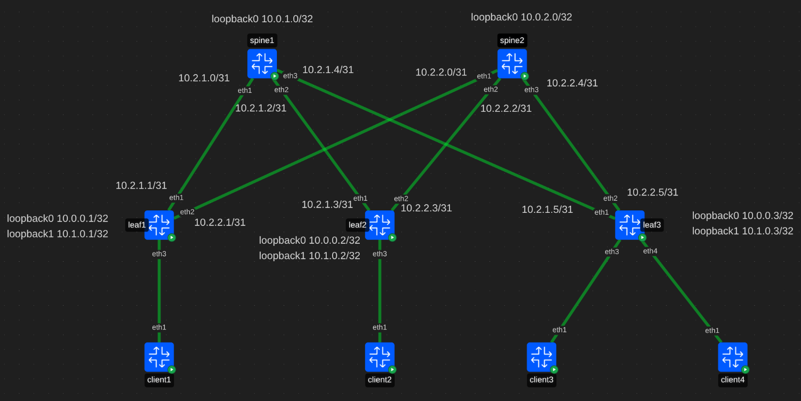

# Проектирование адресного пространства

## Схема сети


## Описание адресов
### P2P адреса
Адреса между устройствами определяются следующим образом:

```bash
10.2.spine_number.leaf_number
```
где:  
*spine_number* - номер спайна;  
*leaf_number* - номер лифа, подключенного к спайну. Для адреса на спайне,
номер лифа равен 0.

Так как один линк предполагает два адреса, используется 31 подсеть.
Таким образом за адрес устройства будет отвечать один последний бит.
Если этот бит равен **0**, то это свидетельствует о том, что это адрес на
спайне, а если бит равен **1**, то на лифе.

Например, адреса между *spine1* и всеми лифами формируются следующим образом:

1. Часть `10.2` одинаковая для всех *p2p* адресов. 
2. На спайне третий байт равен `1`, так как это первый спайн, а на интерфейсе лифа, так
как этот интерфейс подключен к первому спайну.
3. При использовании **31 маски** на адреса устройств остается всего 1 бит,
т.е в такой сети всего два адреса. Поэтому адрес на линке спайна всегда будет заканчиваться 0 в бинарном виде, а адрес на линке лифа всегда на 1.
Каждая пара чисел, начиная с 0 будет соответствовать двум адресам на одном линке.

Таблица адресов для **spine1**:
|Spine interface|Spine interface address|Leaf interface address|Leaf interface|Leaf |
|---------------|-----------------------|----------------------|--------------|-----|
|eth1           |10.2.1.0/31            |10.2.1.1/31           |eth1          |leaf1|
|eth2           |10.2.1.2/31            |10.2.1.3/31           |eth1          |leaf2|
|eth3           |10.2.1.4/31            |10.2.1.5/31           |eth1          |leaf3|

Адреса подсети будут соответствовать адресам интерфейсов на спайне.
Второй адрес в подсети будет присваиваться лифам.

Такой подход экономит адресное пространство и
позволяет легко определить какому устройству принадлежит адрес.

Например, адрес: 10.2.1.3/31.  
1) Второй байт указывает на **p2p** адрес.
2) Третий байт указывает на линк от **spine1**.
3) Четвертый байт нечетный, т.е. заканчивается 1 в двоичной записи числа,
а значит принадлежит лифу. Так как это вторая подсетка, этот адрес принадлежит **leaf2**.
