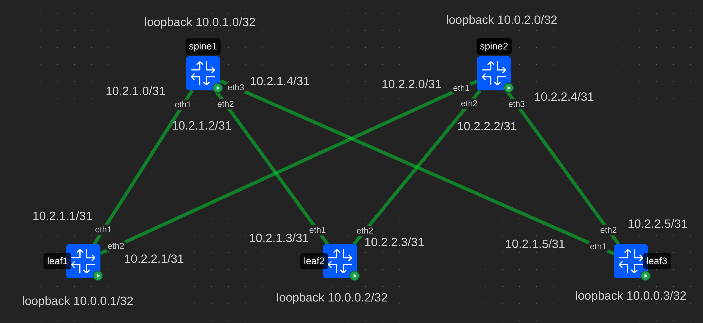
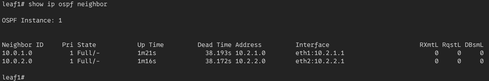
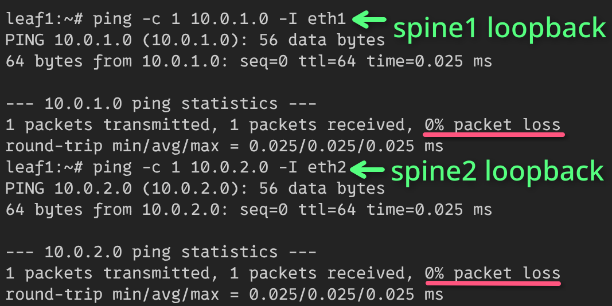
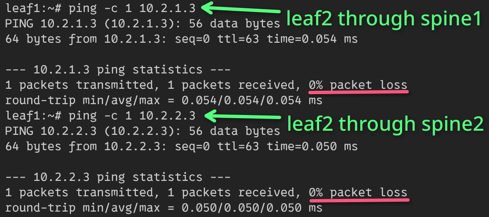
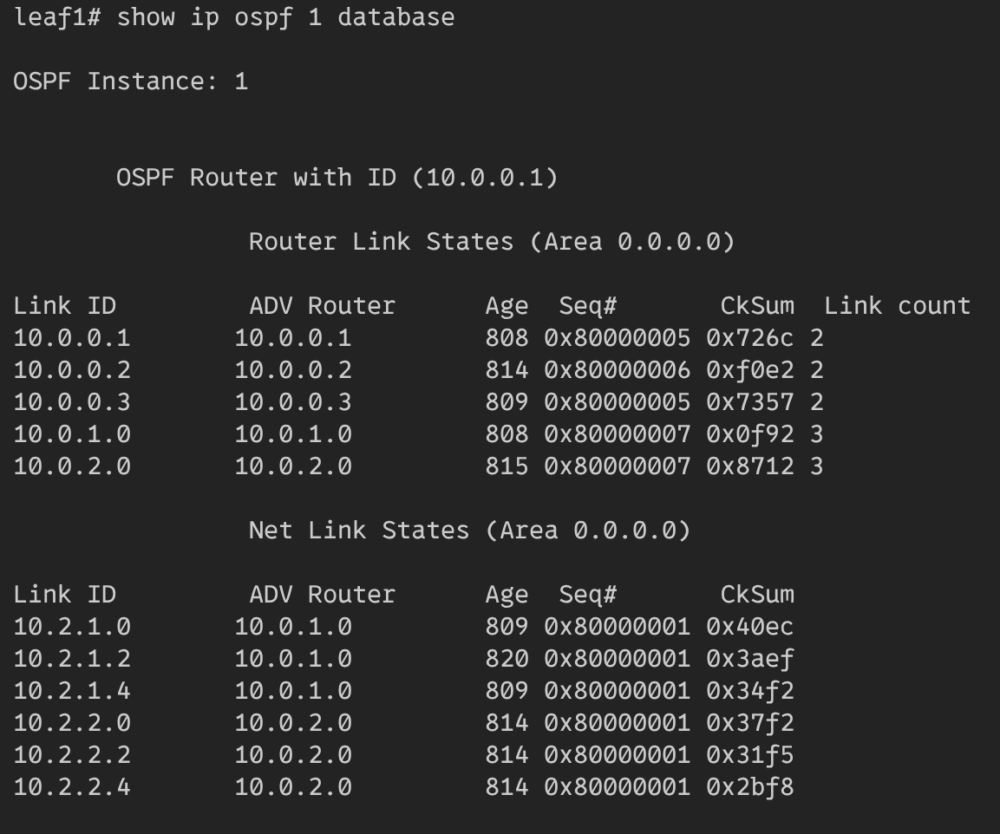

# Underlay. OSPF

## Схема сети


Все конфиги лежат рядом с этим файлом в *toml* формате.

## Конфигурация FRR
На каждом устройстве включены следующие демоны **frr**: bfdd, ospfd, ospfd6  
Также включен *ospfd-инстанс*: `ospfd_instances=1`

## Настройка системы (Leaf1)
### Linux
*Loopback* настраивается с помощью *dummy-интерфейса*:

```bash
ip link add dev loopback0 type dummy
ip address add 10.0.0.1/32 dev loopback0
```

На линки в сторону спайнов устанавливаются L3-адреса:

```bash
ip address add 10.2.1.1/31 dev eth1
ip address add 10.2.2.1/31 dev eth2
```

### FRR
#### OSPF
Каждый интерфейс, помещается в **ospf area0**:

```bash
interface ifname
 no ip ospf passive
 ip ospf area 0.0.0.0
```

Ospf будет отключен для всех портов и нужно отдельно включать его на всех
необходимых портах.

Устройство должно анонсироваться:

```bash
router ospf 1
 passive-interface default
 router-id 10.0.0.1
```

Номер `router ospf` должен совпадать с включенным `ospfd_instances`.
Для избежания ошибок, все интерфейсы по умолчанию будут помечены `passive-interface default`.

#### Bfd
Для ускорения сходимости *ospf* включается **bfd**.

Из режима конфигурации нужно включить протокол:
```bash
bfd
 peer 10.0.1.0
```

*peer* совпадает с *router-id* из *ospf*.

Также нужно на каждый интерфейс добавить *bfd*:
```bash
interface eth1
 ip ospf bfd
```

## Результат
### Leafs (Leaf1)
#### OSPF
На лифе в **ospf** видны лупбеки обоих спайнов в корректном состоянии:



* `10.0.1.0` - лупбек **spine1**
* `10.0.2.0` - лупбек **spine2**

И они доступны:  


#### Маршруты
Также появились маршруты до других лифов:


* Желтым выделены маршруты `10.2.1.0` и `10.2.2.0` это линки спайнов, которые подключены к **leaf1**.
* Зеленым выделены подсети, доступные через next hop **spine1**. Голубым указано через что доступны эти подсети.
* Фиолетовым выделены подсети, доступные через next hop **spine2**. Красным указано через что доступны эти подсети.

Оба спайна доступны:


Через спайны доступны и лифы:



Содержимое LSDB на Leaf1:  
