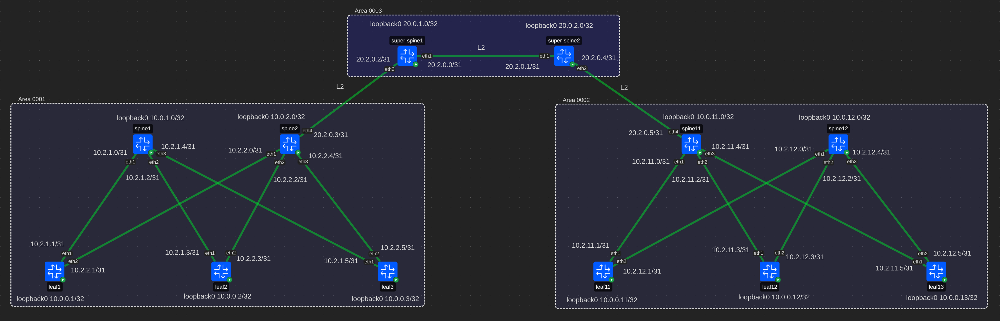
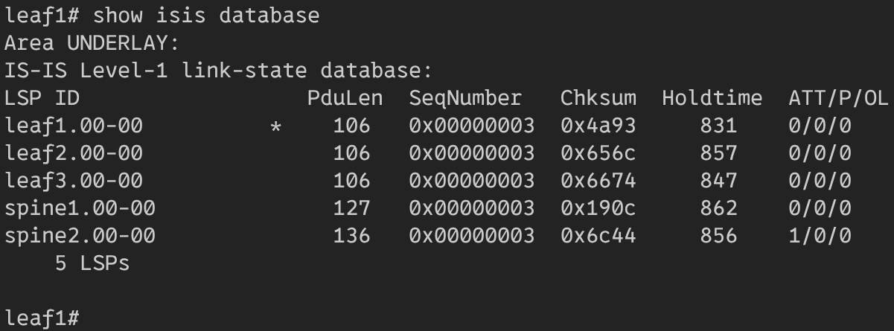
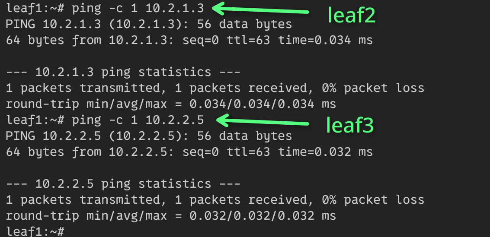
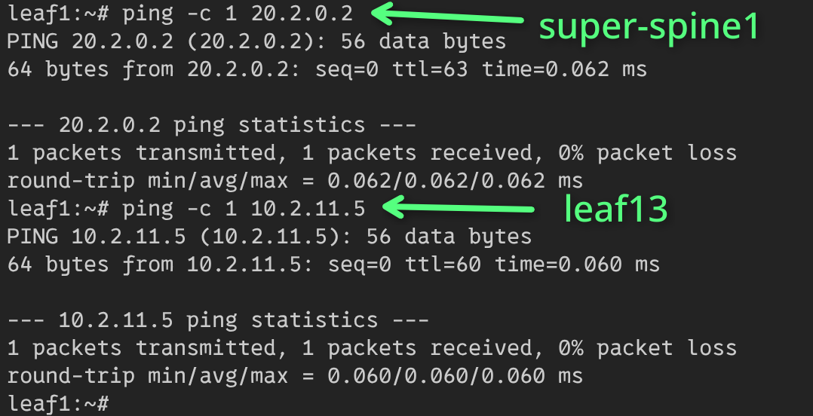
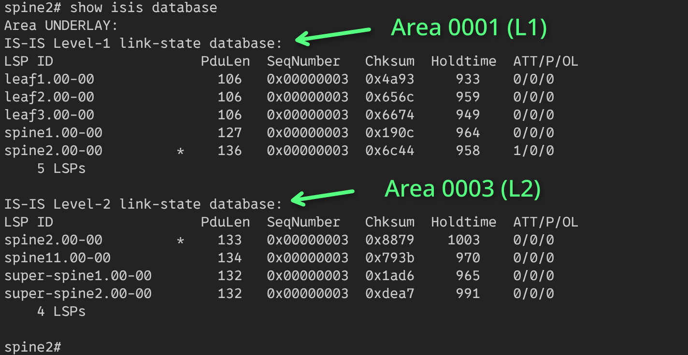
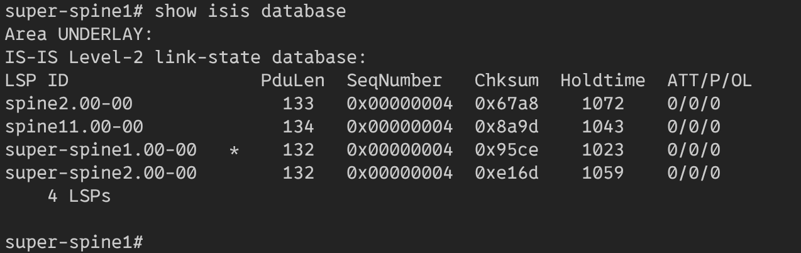
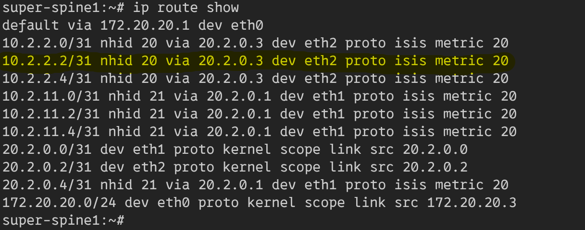
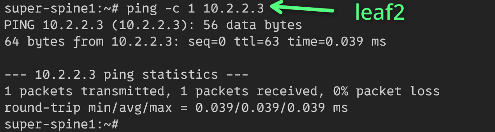

# Underlay. ISIS

## Схема сети


Построена топология из трех зон. Внутри нижних зон используется L1.
В верхней зоне используется L2, для связности двух нижних зон.  
Все конфиги лежат рядом с этим файлом в *toml* формате.

Протокол предполагает полную связность устройств, но спайны не соединены друг
с другом, поэтому не граничные спайны не будут связаны с другими зонами.

## Конфигурация FRR
На каждом устройстве включены следующие демоны **frr**: bfdd, isisd  

## Настройка системы (Leaf1)
### Linux
*Loopback* настраивается с помощью *dummy-интерфейса*:

```bash
ip link add dev loopback0 type dummy
ip address add 10.0.0.1/32 dev loopback0
```

На линки в сторону спайнов устанавливаются L3-адреса:

```bash
ip address add 10.2.1.1/31 dev eth1
ip address add 10.2.2.1/31 dev eth2
```

Для работы с зонами *ISIS* использует *attachment-bit*, с помощью которого
выставляется маршрут по умолчанию для выхода из L1 зоны.
При текущей схеме *frr* не переписывает маршрут по умолчанию,
поэтому нужно удалить его со всех устройств внутри L1 зоны,
кроме граничного спайна.

```bash
ip route del default
```

### FRR
#### ISIS
Нужно настроить протокол на каждом устройстве:

```ini
router isis UNDERLAY
 is-type level-1
 net 49.0001.0100.0000.0001.00
 domain-password md5 ABCDEFGHIJK
exit
```

Выбор *is-type* зависит от положения устройства:
* устройство в одной из нижних зон, если оно не является граничным,
имеет тип: `level-1`. Это **все лифы**, **spine1** и **spine12**.
* устройства в верхней зоне имеют тип: `level-2-only`. Это **оба супер спайна**.
* граничные устройства в нижних зонах имеют тип: `level-1-2`.
Это **spine2** и **spine11**.

Параметр *net* определяется следующим образом: *49.area.system.00*. 
* area определяется так: левая зона - `0001`, правая зона - `0002`,
верхняя зона - `0003`.
* system получается из ip адреса: `012.345.678.9AB` -> `0123.4567.89AB`.

Также надо включить *isis* для интерфейса:
```ini
interface eth1
 ip router isis UNDERLAY
 isis circuit-type level-1
 isis network point-to-point
exit
```

Выбор *isis circuit-type* зависит от типа устройства и соседа линка.
Для всех устройств, кроме граничных, тип интерфейса будет совпадать с типом устройства.
Для граничных, в сторону верхней зоны будет тип `level-2-only`,
а для всех остальных `level-1`.

В данной схеме все подсети p2p, поэтому `isis network point-to-point` используется везде.

Последним шагом является включение протокола на лупбеке:
```ini
interface loopback0
 ip router isis UNDERLAY
exit
```

#### Bfd
Для ускорения сходимости *ospf* включается **bfd**.

Из режима конфигурации нужно включить протокол:
```ini
bfd
 peer 10.0.1.0
```

*peer* совпадает с адресом лупбека.

Также нужно на каждый интерфейс добавить *bfd*:
```ini
interface eth1
 isis bfd
```

## Результат
### Лиф из левой зоны (leaf1)
Этот лиф знает только об устройствах в своей зоне.



Он знает маршрут к каждому из устройств своей зоны.



Также он получил маршрут по умолчанию от граничного *spine2* и может достучаться
до устройств в других зонах.



### Граничный спайн (spine2)
Этот спайн знает о двух зонах, и выполняет редистрибьюцию L1 маршрутов
из зоны 0001 в зону 0003. Он видит все устройства в зоне 0001 и 0003.



### Супер спайн (super-spine1)
Супер спайн находится в L2 зоне и знает обо всех ее устройствах.



Он получает маршруты до устройств из L1 зон от граничных спайнов.
Например, он знает как добраться до *leaf2*.



И он действительно доступен:

