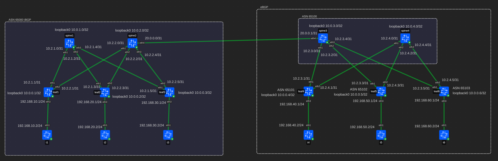
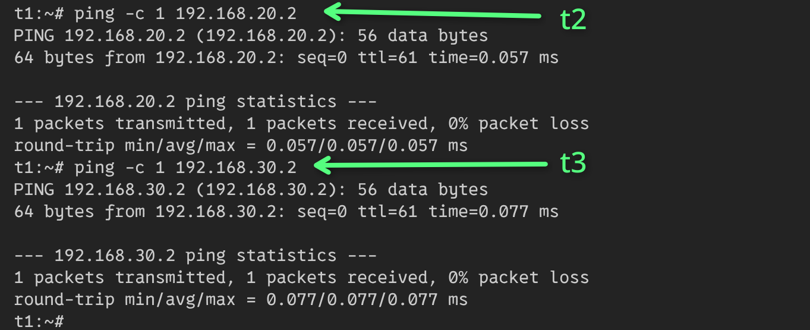
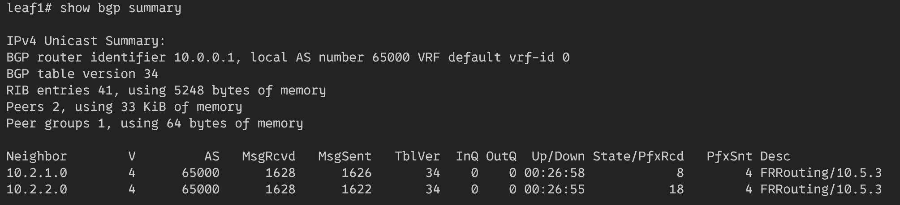
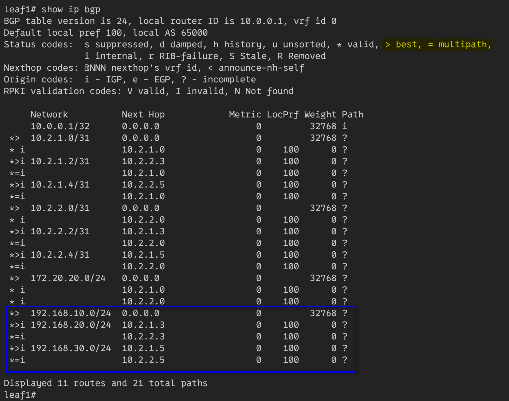
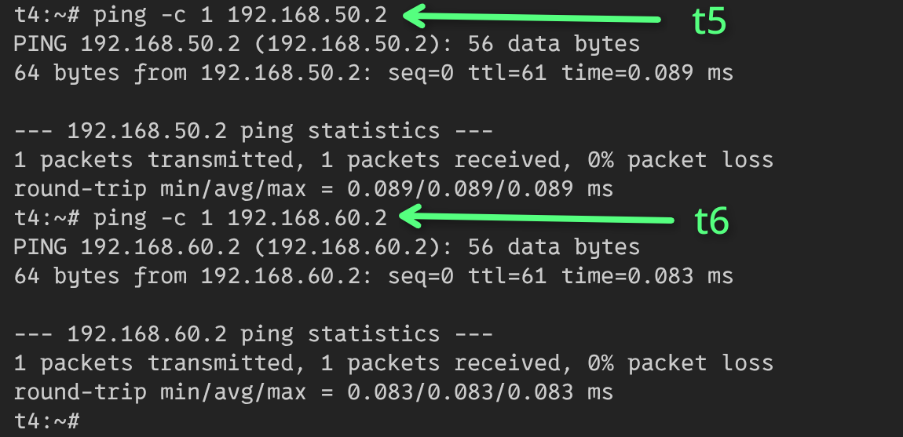
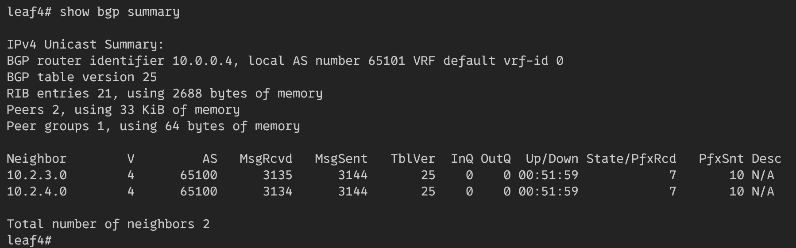
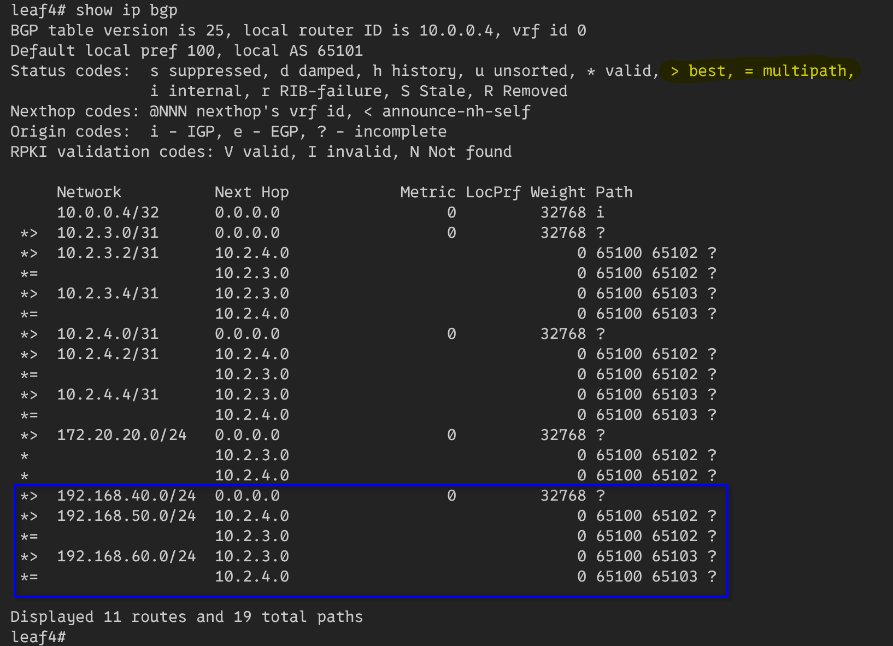
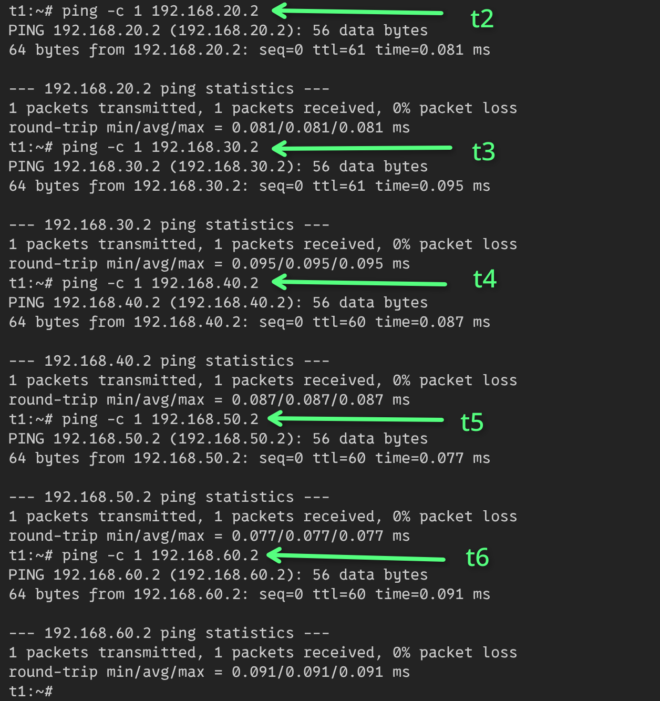
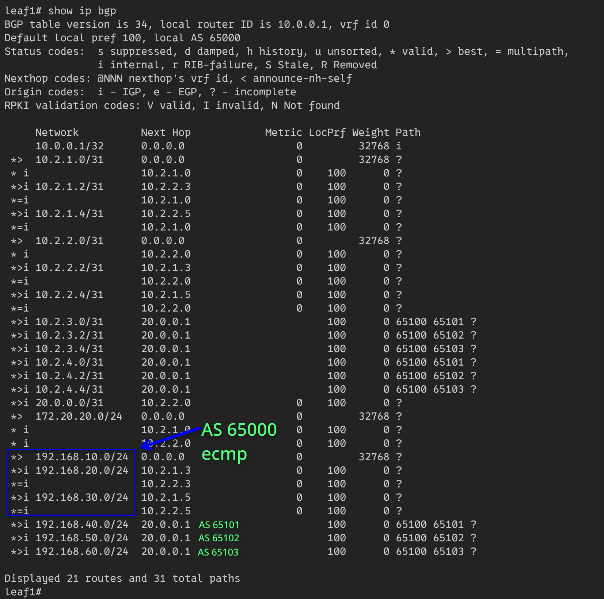
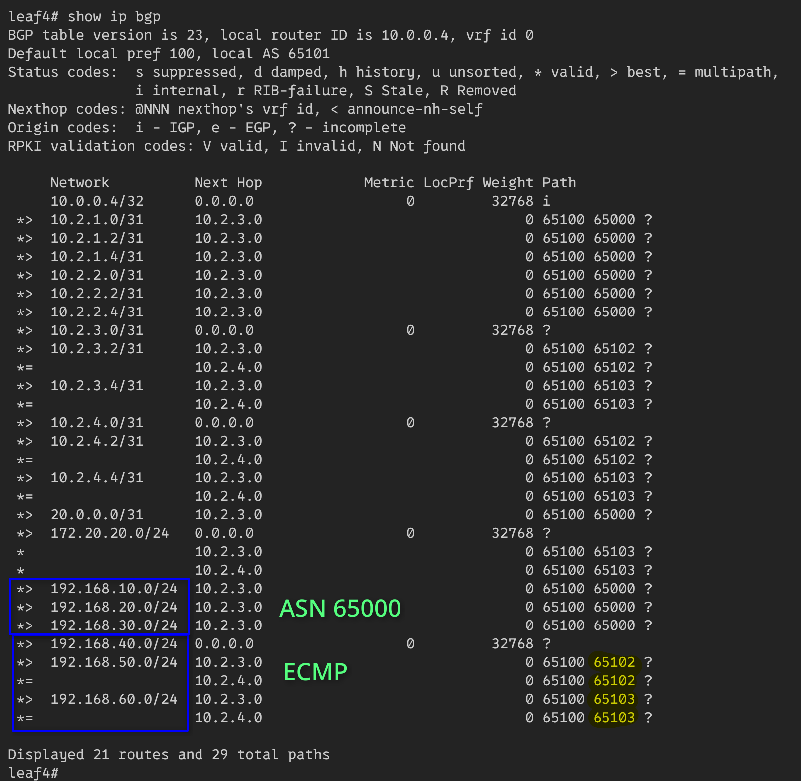

# Underlay. BGP

## Схема сети


Топология предполагает использование **eBGP** и **iBGP**.  
Первый цод имеет одну AS с ASN 65000. В нем используется *iBGP*.  
Второй цод имеет несколько AS С ASN 6500X. В нем используется *eBGP*.
Спайны помещены в зону 65100, а лифы в 65101, 65102, 65103.  
Для связи между цодами используется *eBGP*.

Все конфиги лежат рядом с этим файлом в toml формате.

Протокол *iBGP* предполагает полносвязанную топологию,
но в *clos-сетях* ее нет. Поэтому спайны используются как *route-reflector*.

## Конфигурация контейнеров
В качестве контейнеров для лифов и спайнов использутеся тип **frr**.
На них включены следующие демоны **frr**: bfdd, bgpd.  
В качестве контейнеров клиентов используется тип **linux**.

## Настройка iBGP
### Настройка системы (Leaf1)
#### Linux

Нужно удалить маршрут по умолчанию, указывающий на докер сеть.

```bash
ip route del default
```

*Loopback* настраивается через *dummy-интерфейс*:

```bash
ip link add dev loopback0 type dummy
ip address add 10.0.0.1/32 dev loopback0
```

На линки в сторону спайнов устанавливаются L3-адреса:

```bash
ip address add 10.2.1.1/31 dev eth1
ip address add 10.2.2.1/31 dev eth2
```

На линк в сторону клиента устанавливается ip-адрес:

```bash
ip address add 192.168.10.1/24 dev eth3
```

#### FRR

Конфигурация frr:

```ini
router bgp 65000
 bgp router-id 10.0.0.1
 neighbor SPINES peer-group
 neighbor SPINES remote-as internal
 neighbor SPINES bfd
 neighbor SPINES password ibgp
 neighbor SPINES timers 1 3
 neighbor 10.2.1.0 peer-group SPINES
 neighbor 10.2.2.0 peer-group SPINES
 !
 address-family ipv4 unicast
  network 10.0.0.1/32
  redistribute connected
  maximum-paths ibgp 4
 exit-address-family
exit
!
end
```

С помощью `router bgp` устанавливается **ASN**.  
С помощью `bgp router-id` устанавливается **router id**.  
Команда `neighbor SPINES peer-group` создает группу пиров, для упрощения конфигурации.
Эта группа помечается как **internal** для BGP. Для нее включается **bfd**,
устанавливается пароль и таймеры.  
Команда `neighbor 10.2.1.0 peer-group SPINES` добавляет адрес в пир группу.  
Для редистрибуции маршрутов используется секция `address-family ipv4 unicast`.  
Для включения ecmp используется команда: `maximum-paths ibgp 4`.

### Настройка системы (Spine1)
На спайне система настраивается также как на лифе, за исключением
команды `neighbor LEAFS route-reflector-client`.
Спайны будут передавать свои подключенные маршруты в пир группу *LEAFS*.

## Результат iBGP
### Клиент 1
Все соседние клиенты доступны:



### Лиф 1
Лиф знает об обоих спайнах.



Лиф получил маршруты от других лифов через route-reflector спайны.  
Также можно увидеть ecmp. 



## Настройка eBGP
### Настройка системы (Spine3)
#### Linux

Настройка линукса не отличается от *iBGP*.

#### FRR

Нужно настроить две *route-map*:

```ini
route-map ALLOW permit 1
!
route-map RM_AS_RANGE permit 1
 match as-path PF_AS_RANGE
exit
!
bgp as-path access-list PF_AS_RANGE seq 5 permit 6510[1-9]
```

Мапа `ALLOW` будет использоваться для редистрибуции всех
маршрутов пир группы.  
Мапа `RM_AS_RANGE` будет использоваться для фильтрации
автономных станций через их номера.
Для ее настройки задается *access-list* `PF_AS_RANGE`.
Он принимает все номера автономных станций из диапазона 65101 - 65109.

Настройка bgp:
```
router bgp 65100
 bgp router-id 10.0.3.0
 neighbor LEAFS peer-group
 neighbor LEAFS remote-as external
 neighbor LEAFS bfd
 neighbor LEAFS password ebgp
 neighbor LEAFS timers 1 3
 bgp listen range 10.0.0.0/8 peer-group LEAFS
```

Эта настройка создаст пир группу `LEAFS` с bfd, паролем и
таймерами.  
Для добавления в нее соседей используется команда
`bgp listen range 10.0.0.0/8 peer-group LEAFS`. Она позволит
принимать любых соседей из такой подсети.

Для распространения маршрутов настраивается редистрибуция
подключенных через `RM_AS_RANGE`.  
**По умолчанию frr** отбрасывает маршруты от **eBGP**.
Чтобы он этого не делал надо настроить политику с помощью команд 
`no bgp ebgp-requires-policy` или же 
`neighbor LEAFS route-map RM_AS_RANGE in` с
`neighbor LEAFS route-map ALLOW out`.  
Две последние команды позволят гибко настроить распространение маршрутов.  
Принимать все маршруты, удовлетворяющие `RM_AS_RANGE`.
И отправлять вообще все маршруты.

```
 address-family ipv4 unicast
  network 10.0.3.0/32
  redistribute connected route-map RM_AS_RANGE
  neighbor LEAFS route-map RM_AS_RANGE in
  neighbor LEAFS route-map ALLOW out
  maximum-paths 4
 exit-address-family
exit
!
```

## Результат eBGP

### Клиент 4
Все соседние клиенты доступны:



### Лиф 4

Лиф знает о двух спайнах и о том, что они находятся в одной и той же AS.


У него есть маршруты до всех клиентов:



Также показан ecmp.

## eBGP + iBGP
### Настройка системы (Spine2)
#### Linux
Для андерлей сети добавляется адрес на p2p линк

#### FRR
В конфиг добавляется новый сосед:

```
 neighbor 20.0.0.1 remote-as 65100
 neighbor 20.0.0.1 bfd
 neighbor 20.0.0.1 password dci
 neighbor 20.0.0.1 timers 3 9
```

и для него настраивается полная редистрибуция маршрутов:

```
  neighbor 20.0.0.1 route-map ALLOW in
  neighbor 20.0.0.1 route-map ALLOW out
```

## Результат eBGP - iBGP
### Клиент 1

Клиент может достучаться до всех других клиентов:



### Лиф 1

Устройства в цоде iBGP доступны через ecmp, а остальные без.


### Лиф 4

Устройства в цоде eBGP доступны через ecmp через ASN 65100, а остальные
без ecmp, но через 65100.

