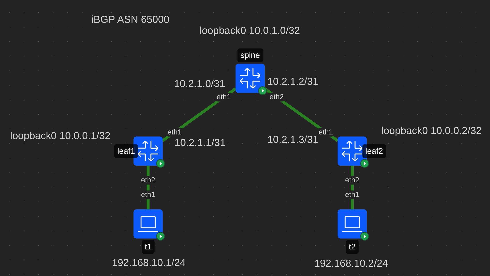
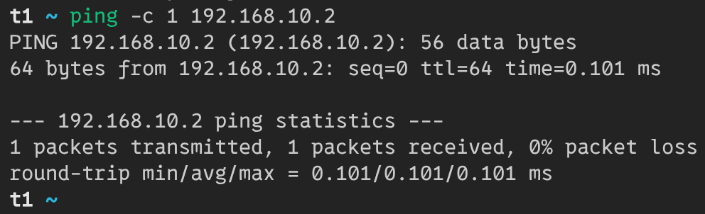
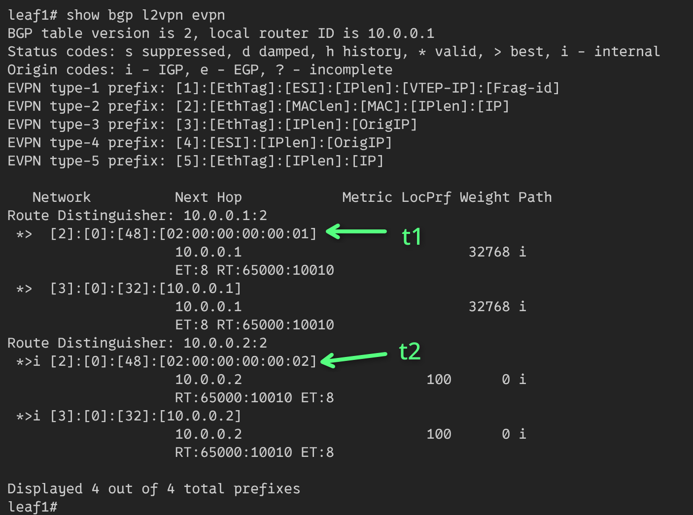
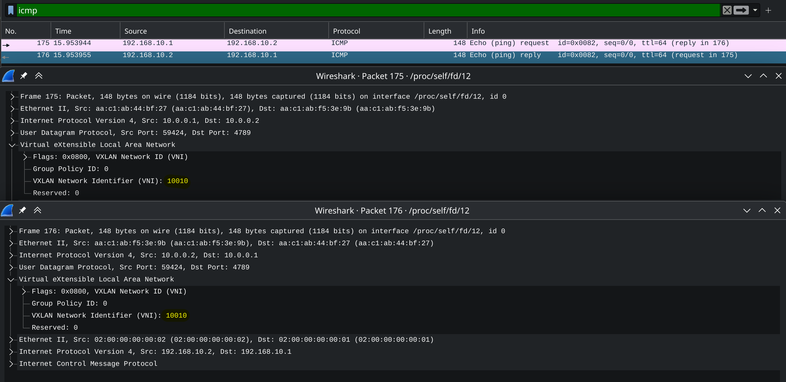

# Ovelay. L2VNI

## Схема сети



В лабе используется *iBGP* для underlay сети.  
Все устройства находятся в ASN 65000.

Протокол *iBGP* предполагает полносвязанную топологию,
но в *clos-сетях* ее нет. Поэтому спайн используется как *route-reflector*.

## Конфигурация контейнеров
В качестве контейнеров для лифов и спайнов использутеся тип **frr**.
На них включены следующие демоны **frr**: bfdd, bgpd.  
В качестве контейнеров клиентов используется тип **linux**.

## Настройка spine
### Linux

```bash
ip route del default

# Loopbacks
ip link add dev loopback0 type dummy
ip address add 10.0.1.0/32 dev loopback0
ip link set dev loopback0 up

# P2p links to leafs
ip address add 10.2.1.0/31 dev eth1
ip address add 10.2.1.2/31 dev eth2
```

Данная настройка удалит маршрут по умолчанию,
создаст loopback0 и установит ip-адреса для p2p линков.

### Frr

```ini
router bgp 65000
 bgp router-id 10.0.1.0
 neighbor LEAFS peer-group
 neighbor LEAFS remote-as internal
 neighbor LEAFS bfd
 neighbor LEAFS password ibgp
 neighbor LEAFS timers 1 3
 neighbor 10.2.1.1 peer-group LEAFS
 neighbor 10.2.1.3 peer-group LEAFS
 !
 address-family ipv4 unicast
  network 10.0.1.0/32
  neighbor LEAFS route-reflector-client
  neighbor LEAFS next-hop-self force
  maximum-paths ibgp 4
 exit-address-family
 !
 address-family l2vpn evpn
  neighbor LEAFS activate
  neighbor LEAFS route-reflector-client
 exit-address-family
exit
!
end
```

Настраивается AS с номером 65000.  
Для лифов создается peer-group, с базовыми настройками:
аутентификация, bfd, timers.  
В пир группу добавляются лифы.

Для underlay-сети используется `address-family ipv4 unicast`.  
Настраивается `route-reflector-client` и для подмены nexthop,
и корректной работы протокола включается `next-hop-self`.

Для overlay-сети включется `route-reflector-client` в evpn.

## Настройка leaf (leaf1)
### Linux

```bash
ip route del default

# Loopbacks
ip link add dev loopback0 type dummy
ip address add 10.0.0.1/32 dev loopback0
ip link set dev loopback0 up

# P2p link to leaf
ip address add 10.2.1.1/31 dev eth1

# Bridge
ip link add br0 type bridge vlan_filtering 1 vlan_default_pvid 0
ip link add vxlan0 type vxlan dstport 4789 local 10.0.0.1 nolearning external vnifilter
ip link set vxlan0 master br0
ip link set br0 up
ip link set vxlan0 up
bridge link set dev vxlan0 vlan_tunnel on

# l2vni 10010 - vlan 10
bridge vlan add dev br0 vid 10 self
bridge vlan add dev vxlan0 vid 10
bridge vni add dev vxlan0 vni 10010
bridge vlan add dev vxlan0 vid 10 tunnel_info id 10010

# Link to client
ip link set dev eth2 master br0
bridge vlan add vid 10 dev eth2 pvid 10 egress untagged
```

Данная настройка удалит маршрут по умолчанию,
создаст loopback0 и установит ip-адрес для p2p линка.

Для работы overlay-сети будет создан bridge и
vxlan-интерфейс в режиме single vxlan device.

Будет настроено соотношение между vni 10010 и vlan 10.

Для линка в сторону клиента будет назначен vlan 10.

### Frr

```ini
router bgp 65000
 bgp router-id 10.0.0.1
 neighbor SPINES peer-group
 neighbor SPINES remote-as internal
 neighbor SPINES bfd
 neighbor SPINES password ibgp
 neighbor SPINES timers 1 3
 neighbor 10.2.1.0 peer-group SPINES
 !
 address-family ipv4 unicast
  network 10.0.0.1/32
  maximum-paths ibgp 4
 exit-address-family
 !
 address-family l2vpn evpn
  neighbor SPINES activate
  advertise-all-vni
 exit-address-family
exit
!
end
```

Настраивается AS с номером 65000.  
Для спайна создается peer-group, с базовыми настройками:
аутентификация, bfd, timers.  
В пир группу добавляется спайн.

Для underlay-сети используется `address-family ipv4 unicast`.  
Настраивается `maximum-paths ibgp` для ecmp.

Включается overlay-сеть и распространение vni.

## Клиент (t1)

```bash
ip address add 192.168.10.1/24 dev eth1
```

Для клиента настраивается только один адрес.

## Результат

Сеть работает: t1 может пропинговать t2:


На leaf1 есть все rt2 и rt3 маршруты:


Leaf1 с Route Distinguisher: 10.0.0.1:2
анонсирует RT-3 маршрут со своим ip loopback 10.0.0.1 для получения
bum-трафика, и RT-2 маршрут с mac-адресом t1.

Leaf2 с Route Distinguisher: 10.0.0.2:2
анонсирует RT-3 маршрут со своим ip loopback 10.0.0.2 для получения
bum-трафика, и RT-2 маршрут с mac-адресом t2.

Пакеты, действительно, инкапсулируются и летят в vni 10010

