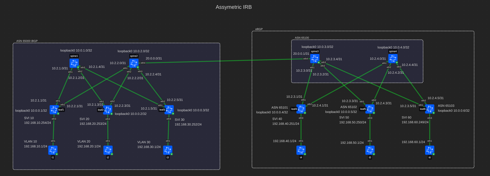
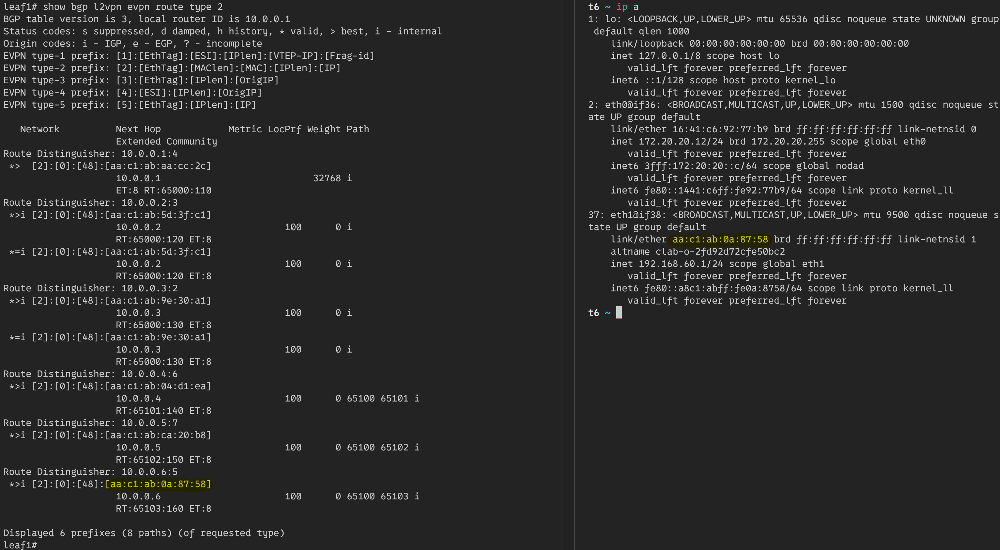
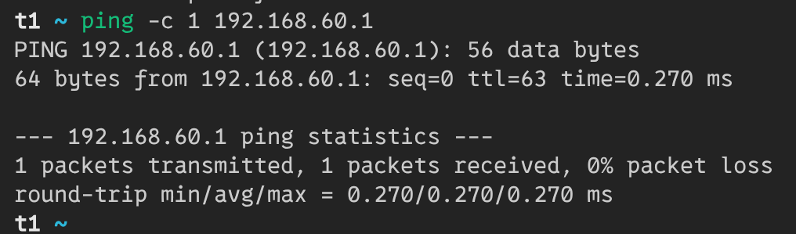

# Ovelay. L2VNI

## Схема сети



Топология предполагает использование **eBGP** и **iBGP**.  
Первый цод имеет одну AS с ASN 65000. В нем используется *iBGP*.  
Второй цод имеет несколько AS С ASN 6500X. В нем используется *eBGP*.
Спайны помещены в зону 65100, а лифы в 65101, 65102, 65103.  
Для связи между цодами используется *eBGP*.

Все конфиги лежат рядом с этим файлом в toml формате.

Протокол *iBGP* предполагает полносвязанную топологию,
но в *clos-сетях* ее нет. Поэтому спайны используются как *route-reflector*.

Каждый клиент будет находиться в своем vlan. На каждом лифе будут все vni.

## Конфигурация контейнеров
В качестве контейнеров для лифов и спайнов использутеся тип **frr**.
На них включены следующие демоны **frr**: bfdd, bgpd.  
В качестве контейнеров клиентов используется тип **linux**.

## Настройка underlay
Underlay сеть не изменяется относительно 4 работы, кроме переноса
default gw для клиентов с обычных линков на svi для всех лифов.
А также переключения линков на лифах в сторону клиента в access режим
для соответсвующих vlan.

## Настройка overlay
### iBGP
#### Spine
##### Frr
Для спайнов нужно добавить `route-reflector` для evpn:

```ini
 address-family l2vpn evpn
  neighbor LEAFS activate
  neighbor LEAFS route-reflector-client
 exit-address-family
```

#### Leaf
##### Frr
Нужно включить распространение всех vni для evpn:
```ini
 address-family l2vpn evpn
  neighbor SPINES activate
  advertise-all-vni
 exit-address-family
```

##### Linux

Нужно создать бридж и vxlan интерфейс для работы с vlan и vxlan:
```bash
# Bridge
ip link add br0 type bridge vlan_filtering 1 vlan_default_pvid 0
ip link add vxlan0 type vxlan dstport 4789 local 10.0.0.1 nolearning external vnifilter
ip link set vxlan0 master br0
ip link set br0 up
ip link set vxlan0 up
bridge link set dev vxlan0 vlan_tunnel on
```

В качестве `local` используется адрес loopback-интерфейса.

Для каждого vni нужно настроить маппинг на vlan и svi-интерфейс:
```bash
bridge vlan add dev br0 vid 10 self
bridge vlan add dev vxlan0 vid 10
bridge vni add dev vxlan0 vni 110
bridge vlan add dev vxlan0 vid 10 tunnel_info id 110
ip link add vlan10 link br0 type vlan id 10
ip addr add 192.168.10.254/24 dev vlan10
ip link set vlan10 up
```

### eBGP
#### Spine
##### Frr
Нужно активировать evpn для всех нужных соседей:
```bash
 address-family l2vpn evpn
  neighbor LEAFS activate
  neighbor LEAFS route-map RM_AS_RANGE in
  neighbor LEAFS route-map ALLOW out
  advertise-all-vni
 exit-address-family
```

#### Leaf
##### Frr
Нужно активировать evpn для всех нужных соседей:
```bash
 address-family l2vpn evpn
  neighbor LEAFS activate
  neighbor LEAFS route-map RM_AS_RANGE in
  neighbor LEAFS route-map ALLOW out
  advertise-all-vni
 exit-address-family
```

##### Linux
Настройка vxlan устройств не отличается от iBGP.

## Результат
На leaf1 есть rt2 маршруты, полученные от всех лифов. На скриншоте выделен мак-адрес t6, 
к которому будет отправлен пинг запрос от t1, через leaf1.



t1 может пропинговать t6:



При этом запрос летит в vni 6 клиента - 160,
а ответ в vni 1 клиента - 110:


