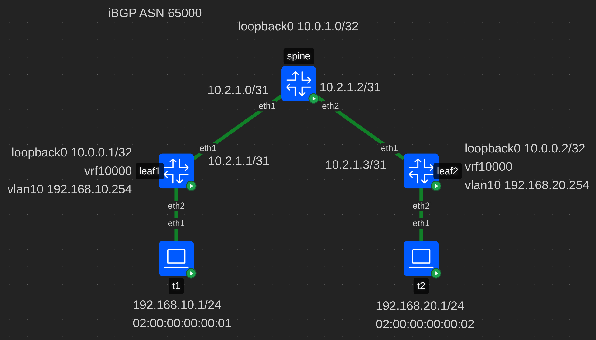
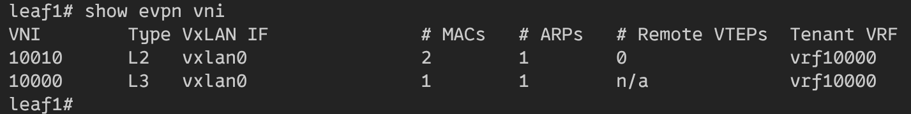
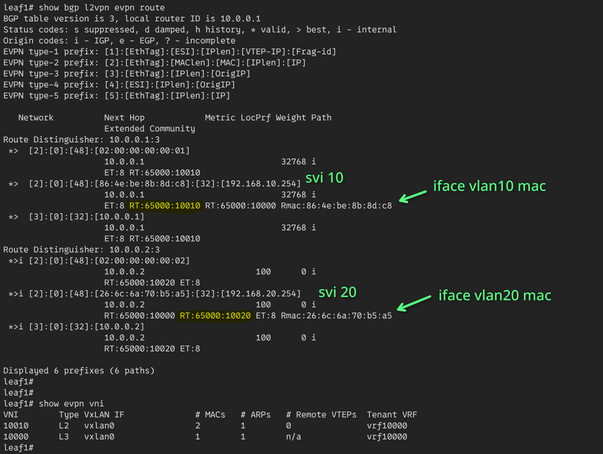
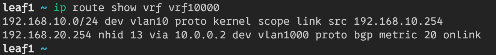
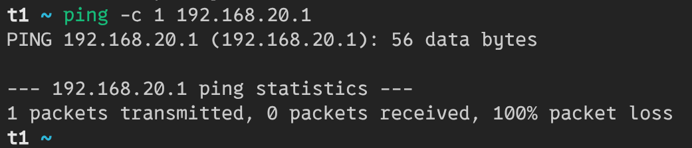
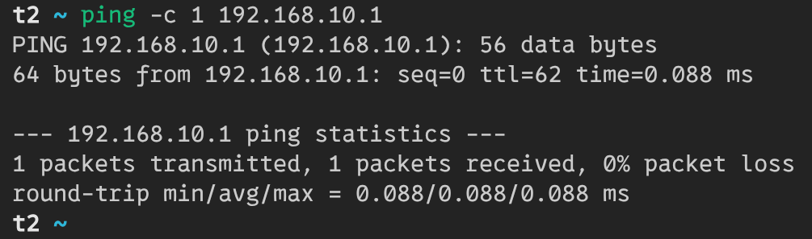
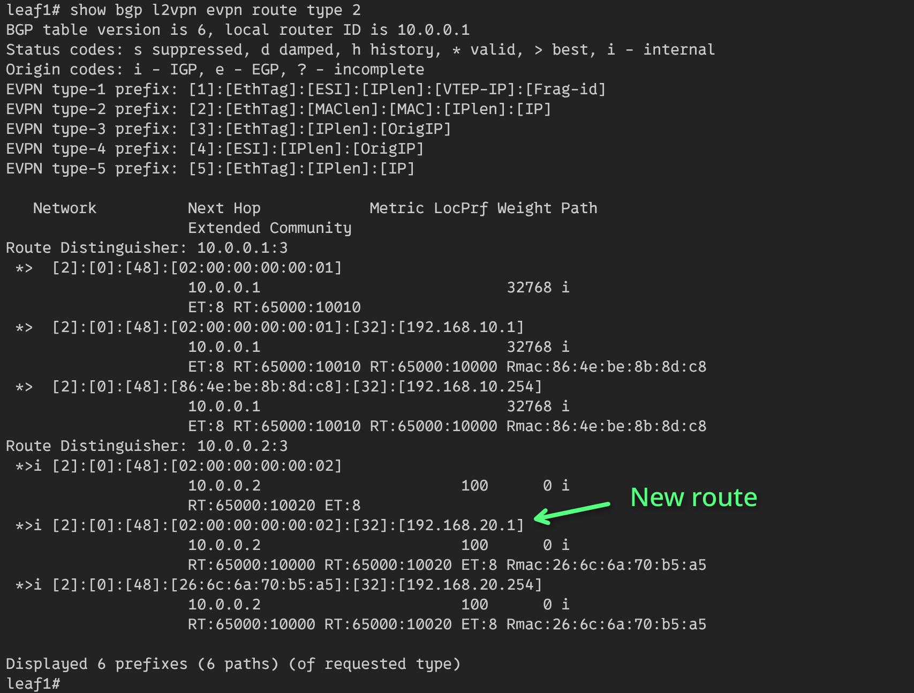
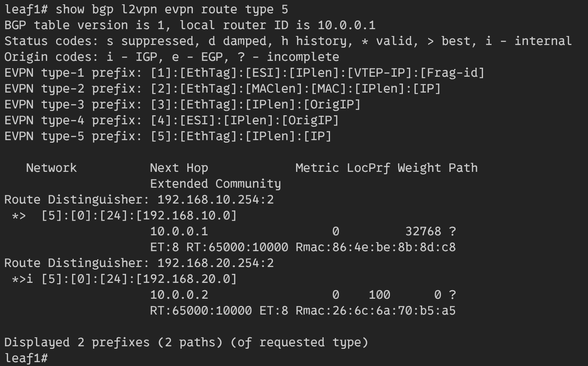
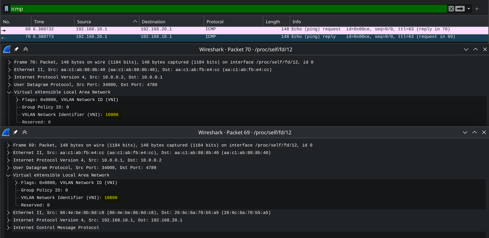

# Ovelay. L3VNI

## Схема сети



В лабе используется *iBGP* для underlay сети.  
Все устройства находятся в ASN 65000.

Протокол *iBGP* предполагает полносвязанную топологию,
но в *clos-сетях* ее нет. Поэтому спайн используется как *route-reflector*.

## Конфигурация контейнеров
В качестве контейнеров для лифов и спайнов использутеся тип **frr**.
На них включены следующие демоны **frr**: bfdd, bgpd.  
В качестве контейнеров клиентов используется тип **linux**.

## Настройка spine
### Linux

```bash
ip route del default

# Loopbacks
ip link add dev loopback0 type dummy
ip address add 10.0.1.0/32 dev loopback0
ip link set dev loopback0 up

# P2p links to leafs
ip address add 10.2.1.0/31 dev eth1
ip address add 10.2.1.2/31 dev eth2
```

Данная настройка удалит маршрут по умолчанию,
создаст loopback0 и установит ip-адреса для p2p линков.

### Frr

```ini
router bgp 65000
 bgp router-id 10.0.1.0
 neighbor LEAFS peer-group
 neighbor LEAFS remote-as internal
 neighbor LEAFS bfd
 neighbor LEAFS password ibgp
 neighbor LEAFS timers 1 3
 neighbor 10.2.1.1 peer-group LEAFS
 neighbor 10.2.1.3 peer-group LEAFS
 !
 address-family ipv4 unicast
  network 10.0.1.0/32
  neighbor LEAFS route-reflector-client
  neighbor LEAFS next-hop-self force
  maximum-paths ibgp 4
 exit-address-family
 !
 address-family l2vpn evpn
  neighbor LEAFS activate
  neighbor LEAFS route-reflector-client
 exit-address-family
exit
!
end
```

Настраивается AS с номером 65000.  
Для лифов создается peer-group, с базовыми настройками:
аутентификация, bfd, timers.  
В пир группу добавляются лифы.

Для underlay-сети используется `address-family ipv4 unicast`.  
Настраивается `route-reflector-client` и для подмены nexthop,
и корректной работы протокола включается `next-hop-self`.

Для overlay-сети включется `route-reflector-client` в evpn.

## Настройка leaf (leaf1)
### Linux

```bash
ip route del default

# Loopbacks
ip link add dev loopback0 type dummy
ip address add 10.0.0.1/32 dev loopback0
ip link set dev loopback0 up

# P2p link to leaf
ip address add 10.2.1.1/31 dev eth1

# Bridge
ip link add br0 type bridge vlan_filtering 1 vlan_default_pvid 0
ip link add vxlan0 type vxlan dstport 4789 local 10.0.0.1 nolearning external vnifilter
ip link set vxlan0 master br0
ip link set br0 up
ip link set vxlan0 up
bridge link set dev vxlan0 vlan_tunnel on

# vrf for l3vni 10000
ip link add vrf10000 type vrf table 10000
ip link set vrf10000 up

# l3vni 10000 - vlan 1000
bridge vlan add dev br0 vid 1000 self
bridge vlan add dev vxlan0 vid 1000
bridge vni add dev vxlan0 vni 10000
bridge vlan add dev vxlan0 vid 1000 tunnel_info id 10000
ip link add vlan1000 link br0 type vlan id 1000
ip link set vlan1000 master vrf10000
ip link set vlan1000 up

# l2vni 10010 - vlan 10
bridge vlan add dev br0 vid 10 self
bridge vlan add dev vxlan0 vid 10
bridge vni add dev vxlan0 vni 10010
bridge vlan add dev vxlan0 vid 10 tunnel_info id 10010
ip link add vlan10 link br0 type vlan id 10
ip link set vlan10 master vrf10000
ip addr add 192.168.10.254/24 dev vlan10
ip link set vlan10 up

# Link to client
ip link set dev eth2 master br0
bridge vlan add vid 10 dev eth2 pvid 10 egress untagged
```

Данная настройка удалит маршрут по умолчанию,
создаст loopback0 и установит ip-адрес для p2p линка.

Для работы overlay-сети будет создан bridge и
vxlan-интерфейс в режиме single vxlan device.  
Для функционирования l3vni создается vrf10000.  

Будет настроено соотношение между vni 10000 и vlan 1000.
Svi для vlan будет помещен в vrf10000. Это служебный vni,
для работы симметричного IRB.

Для работы с клиентами настроится маппинг между vni 10010
и vlan 10. На svi для vlan будет назначен ip-адрес 192.168.10.254,
а также он будет помещен в vrf10000.

Для линка в сторону клиента будет назначен vlan 10.

### Frr

```ini
vrf vrf10000
 vni 10000
exit-vrf
!
router bgp 65000
 bgp router-id 10.0.0.1
 neighbor SPINES peer-group
 neighbor SPINES remote-as internal
 neighbor SPINES bfd
 neighbor SPINES password ibgp
 neighbor SPINES timers 1 3
 neighbor 10.2.1.0 peer-group SPINES
 !
 address-family ipv4 unicast
  network 10.0.0.1/32
  maximum-paths ibgp 4
 exit-address-family
 !
 address-family l2vpn evpn
  neighbor SPINES activate
  advertise-all-vni
  advertise-svi-ip
 exit-address-family
exit
!
router bgp 65000 vrf vrf10000
 !
 address-family l2vpn evpn
  advertise ipv4 unicast
 exit-address-family
exit
!
end
```

Настраивается AS с номером 65000.  
Для спайна создается peer-group, с базовыми настройками:
аутентификация, bfd, timers.  
В пир группу добавляется спайн.

Для underlay-сети используется `address-family ipv4 unicast`.  
Настраивается `maximum-paths ibgp` для ecmp.

Включается overlay-сеть и распространение vni.
Для overlay-сети настраивается vrf10000, в рамках которого также
будет распространятся l2vpn маршруты.

## Клиент (t1)

```bash
ip link set address 02:00:00:00:00:01 dev eth1
ip address add 192.168.10.1/24 dev eth1
ip route replace default via 192.168.10.254 dev eth1
```

Для клиента настраивается ip-адрес и маршрут по умолчанию,
через svi-интерфейс на лифе.

## Результат

На лифе есть два vni: 10000 - L3, 10010 - L2



Таблица маршрутов на leaf1:



Rt-2 mac + ip маршрут до vlan 10 в имеет route target:
RT:65000:10010.  
Rt-2 mac + ip маршрут до vlan 20 в имеет route target:
RT:65000:10020.  

Когда t1, отправит пинг запрос на t2, он пошлет его через svi 10.
L2 уровень поднимет пакет на маршрутизацию и leaf1 посмотрит свою таблицу
маршрутизации для vrf10000:



У него нет маршрута до сети `192.168.20.0/24`,
поэтому пакет будет отброшен и пинг с t1 не пройдет:



Это можно решить несколькими способами, например отправить пинг с t2:



После этого leaf2 узнает об ip t2 и на leaf1 появится новый RT-2 маршрут:



Это позволит t1 достучаться до t2:


Вторым способом является включение редистрибуции маршрутов в рамках
vrf, с помощью настройки:

```ini
router bgp 65000 vrf vrf10000
 !
 address-family ipv4 unicast
  redistribute connected
 !
 address-family l2vpn evpn
  advertise ipv4 unicast
!
end
```

После нее лифы узнают о подключенных сетях друг друга через RT-5:



Пакеты, действительно, инкапсулируются и летят в служебном vni 10000

