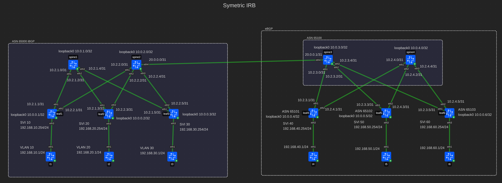
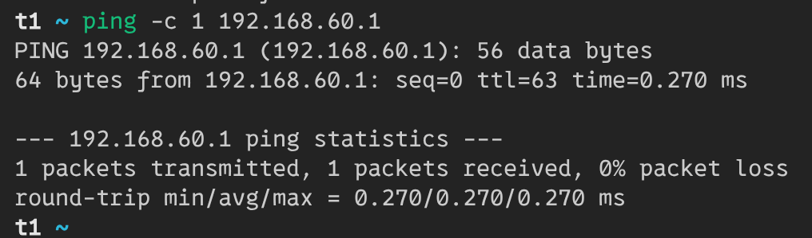
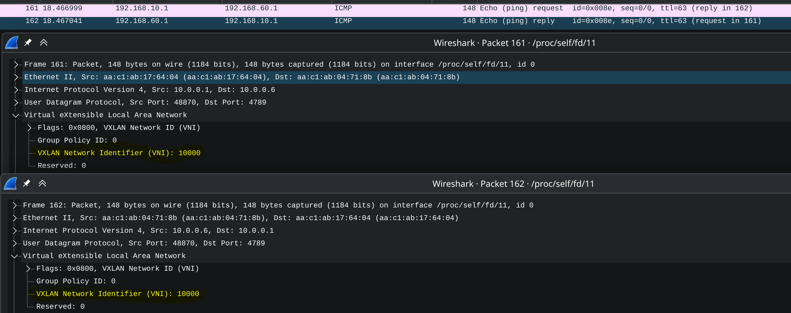

# Ovelay. L3VNI

## Схема сети



Топология предполагает использование **eBGP** и **iBGP**.  
Первый цод имеет одну AS с ASN 65000. В нем используется *iBGP*.  
Второй цод имеет несколько AS С ASN 6500X. В нем используется *eBGP*.
Спайны помещены в зону 65100, а лифы в 65101, 65102, 65103.  
Для связи между цодами используется *eBGP*.

Все конфиги лежат рядом с этим файлом в toml формате.

Протокол *iBGP* предполагает полносвязанную топологию,
но в *clos-сетях* ее нет. Поэтому спайны используются как *route-reflector*.

Каждый клиент будет находиться в своем vlan. На каждом лифе будeт один vlan для клиент,
а также один служебный vni.

## Конфигурация контейнеров
В качестве контейнеров для лифов и спайнов использутеся тип **frr**.
На них включены следующие демоны **frr**: bfdd, bgpd.  
В качестве контейнеров клиентов используется тип **linux**.

## Настройка underlay
Underlay сеть не изменяется относительно 4 работы, кроме переноса
default gw для клиентов с обычных линков на svi для всех лифов.
А также переключения линков на лифах в сторону клиента в access режим
для соответсвующих vlan.

## Настройка overlay
### iBGP
#### Spine
##### Frr
Для спайнов нужно добавить `route-reflector` для evpn:

```ini
 address-family l2vpn evpn
  neighbor LEAFS activate
  neighbor LEAFS route-reflector-client
 exit-address-family
```

#### Leaf
##### Frr
Нужно включить распространение всех vni для evpn:
```ini
 address-family l2vpn evpn
  neighbor SPINES activate
  advertise-all-vni
 exit-address-family
```

Добавить vrf:
```ini
vrf vrf10000
 vni 10000
exit-vrf
```

И включить для него bgp:
```ini
router bgp 65000 vrf vrf10000
 !
 address-family ipv4 unicast
  redistribute connected
 exit-address-family
 !
 address-family ipv6 unicast
  redistribute connected
 exit-address-family
 !
 address-family l2vpn evpn
  advertise ipv4 unicast
  advertise ipv6 unicast
 exit-address-family
exit
!
end
```

##### Linux

Для работы требуется vrf:
```bash
# vrf for l3vni 10000
ip link add vrf10000 type vrf table 10000
ip link set vrf10000 up
```

Нужно создать бридж и vxlan интерфейс для работы с vlan и vxlan:
```bash
# Bridge
ip link add br0 type bridge vlan_filtering 1 vlan_default_pvid 0
ip link add vxlan0 type vxlan dstport 4789 local 10.0.0.1 nolearning external vnifilter
ip link set vxlan0 master br0
ip link set br0 up
ip link set vxlan0 up
bridge link set dev vxlan0 vlan_tunnel on
```

В качестве `local` используется адрес loopback-интерфейса.

Для каждого vni нужно настроить маппинг на vlan и svi-интерфейс:
```bash
# l3vni 10000 - vlan 1000
bridge vlan add dev br0 vid 1000 self
bridge vlan add dev vxlan0 vid 1000
bridge vni add dev vxlan0 vni 10000
bridge vlan add dev vxlan0 vid 1000 tunnel_info id 10000
ip link add vlan1100 link br0 type vlan id 1000
ip link set vlan1100 master vrf10000
ip link set vlan1100 up
```

### eBGP
#### Spine
##### Frr
Нужно активировать evpn для всех нужных соседей:
```bash
 address-family l2vpn evpn
  neighbor LEAFS activate
  neighbor LEAFS route-map RM_AS_RANGE in
  neighbor LEAFS route-map ALLOW out
  advertise-all-vni
 exit-address-family
```

#### Leaf
##### Frr
Нужно активировать evpn для всех нужных соседей:
```bash
 address-family l2vpn evpn
  neighbor LEAFS activate
  neighbor LEAFS route-map RM_AS_RANGE in
  neighbor LEAFS route-map ALLOW out
  advertise-all-vni
 exit-address-family
```

Добавить vrf:
```ini
vrf vrf10000
 vni 10000
exit-vrf
```

И включить для него bgp:
```ini
router bgp 65000 vrf vrf10000
 !
 address-family ipv4 unicast
  redistribute connected
 exit-address-family
 !
 address-family ipv6 unicast
  redistribute connected
 exit-address-family
 !
 address-family l2vpn evpn
  advertise ipv4 unicast
  advertise ipv6 unicast
 exit-address-family
exit
!
end
```

##### Linux
Настройка vxlan устройств не отличается от iBGP.

## Результат
t1 может пропинговать t2:



При этом и запрос и ответ летят в служебном vni 1000.

