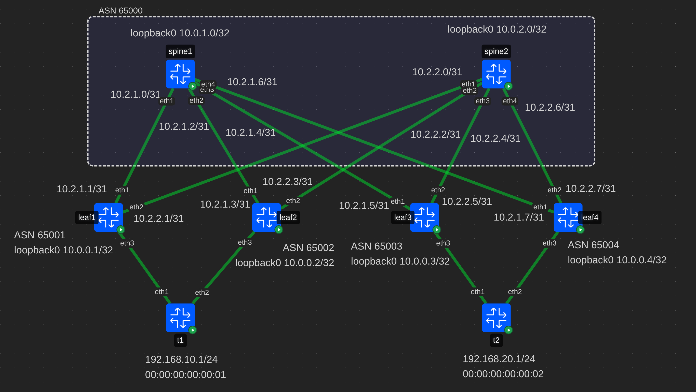

# VXLAN. Multihoming

## Схема сети



В лабе используется *eBGP* для underlay сети.  
Два спайна находятся в ASN 65000, а каждый лиф находится
в своей ASN.

## Конфигурация контейнеров
В качестве контейнеров для лифов и спайнов использутеся тип **frr**.
На них включены следующие демоны **frr**: bfdd, bgpd.  
В качестве контейнеров клиентов используется тип **linux**.

## Настройка spine
### Linux

```bash
ip route del default

# Loopbacks
ip link add dev loopback0 type dummy
ip address add 10.0.1.0/32 dev loopback0
ip link set dev loopback0 up

# P2p links to leafs
ip address add 10.2.1.0/31 dev eth1
ip address add 10.2.1.2/31 dev eth2
ip address add 10.2.1.4/31 dev eth3
ip address add 10.2.1.6/31 dev eth4
```

Данная настройка удалит маршрут по умолчанию,
создаст loopback0 и установит ip-адреса для p2p линков.

### Frr

```ini
route-map ALLOW permit 1
!
route-map RM_L0 permit 2
 match interface loopback0
!
route-map RM_AS_RANGE permit 3
 match as-path PF_AS_RANGE
exit
!
router bgp 65000
 bgp router-id 10.0.1.0
 neighbor LEAFS peer-group
 neighbor LEAFS remote-as external
 neighbor LEAFS bfd
 neighbor LEAFS password ebgp
 neighbor LEAFS timers 1 3
 bgp listen range 10.0.0.0/8 peer-group LEAFS
 !
 address-family ipv4 unicast
  network 10.0.1.0/32
  redistribute connected route-map RM_L0
  neighbor LEAFS route-map RM_AS_RANGE in
  neighbor LEAFS route-map ALLOW out
  maximum-paths 4
 exit-address-family
 !
 address-family l2vpn evpn
  neighbor LEAFS activate
  neighbor LEAFS route-map RM_AS_RANGE in
  neighbor LEAFS route-map ALLOW out
  advertise-all-vni
 exit-address-family
exit
!
bgp as-path access-list PF_AS_RANGE seq 5 permit 6500[1-9]
!
end
```

Настраивается AS с номером 65000.  
Для лифов создается peer-group, с базовыми настройками:
аутентификация, bfd, timers.  
В пир группу добавляется подсеть `10.0.0.0/8`.

Для underlay-сети используется `address-family ipv4 unicast`.  
Будет происходить редистрибуция маршрута с loopback0.

В overlay-сети будут распространяться все vni `advertise-all-vni`.

Для корректной работы *eBGP* frr требует настройки политик распространения
маршрутов. Выходить будут все маршруты, а приниматься только из `PF_AS_RANGE`

## Настройка leaf (leaf1)
### Linux

```bash
ip route del default

# Loopbacks
ip link add dev loopback0 type dummy
ip address add 10.0.0.1/32 dev loopback0
ip link set dev loopback0 up

# Bridge
ip link add br0 type bridge vlan_filtering 1 vlan_default_pvid 0
ip link add vxlan0 type vxlan dstport 4789 local 10.0.0.1 nolearning external vnifilter
ip link set vxlan0 master br0
ip link set br0 up
ip link set vxlan0 up
bridge link set dev vxlan0 vlan_tunnel on

# l2vni 110 - vlan 10
bridge vlan add dev br0 vid 10 self
bridge vlan add dev vxlan0 vid 10
bridge vni add dev vxlan0 vni 110
bridge vlan add dev vxlan0 vid 10 tunnel_info id 110
ip link add vlan10 link br0 type vlan id 10
ip addr add 192.168.10.254/24 dev vlan10
ip link set vlan10 up

# l2vni 120 - vlan 20
bridge vlan add dev br0 vid 20 self
bridge vlan add dev vxlan0 vid 20
bridge vni add dev vxlan0 vni 120
bridge vlan add dev vxlan0 vid 20 tunnel_info id 120
ip link add vlan20 link br0 type vlan id 20
ip addr add 192.168.20.254/24 dev vlan20
ip link set vlan20 up

# P2p links to leafs
ip address add 10.2.1.1/31 dev eth1
ip address add 10.2.2.1/31 dev eth2

# Bond to client
ip link add dev bond0 type bond mode 802.3ad
ip link set dev bond0 up
ip link set dev bond0 master br0
bridge vlan add vid 10 dev bond0 pvid 10 egress untagged

ip link set dev eth3 down
ip link set dev eth3 master bond0
ip link set dev eth3 up
```

Данная настройка удалит маршрут по умолчанию,
создаст loopback0 и установит ip-адрес для p2p линка.

Для работы overlay-сети будет создан bridge и
vxlan-интерфейс в режиме single vxlan device.  

Будет настроено соотношение между vni 10000 и vlan 1000.
Svi для vlan будет помещен в vrf10000. Это служебный vni,
для работы симметричного IRB.

Для работы с клиентами настроится маппинг между vni 10010
и vlan 10. На svi для vlan будет назначен ip-адрес 192.168.10.254,
а также он будет помещен в vrf10000.

Для линка в сторону клиента будет назначен vlan 10.