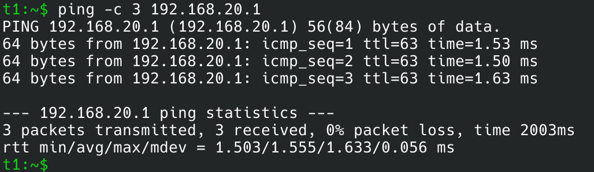
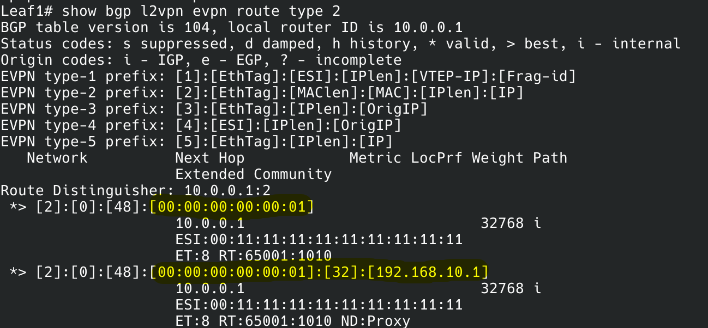
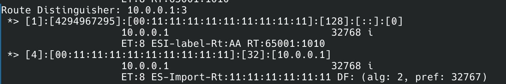
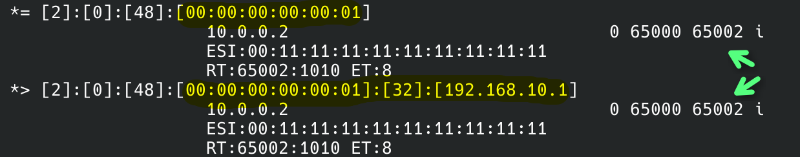
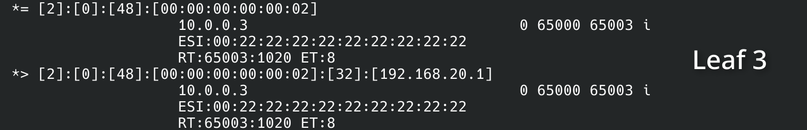
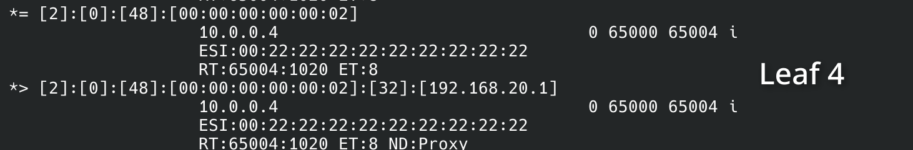
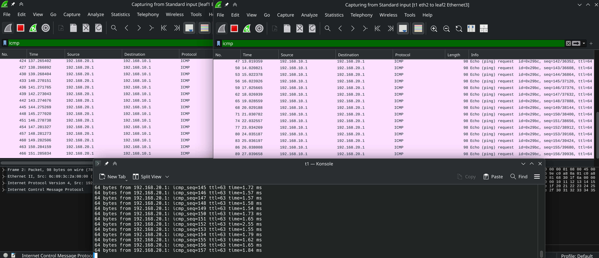
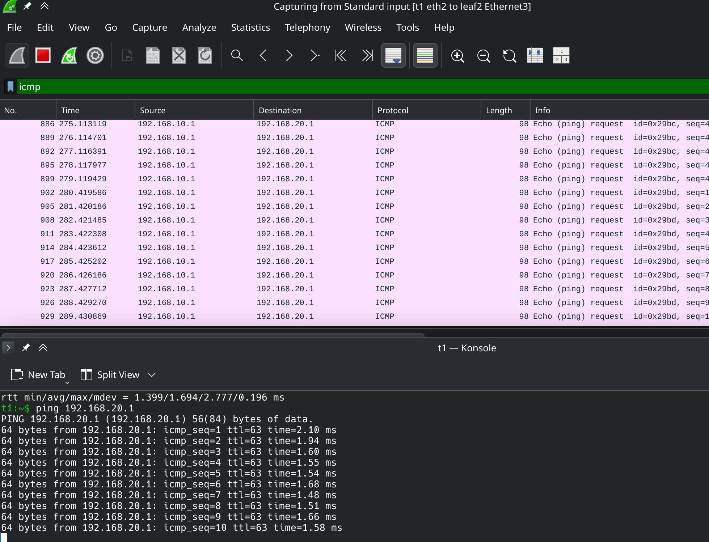

# VXLAN. Multihoming

## Предисловие

Несколько дней дебага привели меня к коллегам, которые сказали,
что без доработок ванильный *frr* не сможет сделать такую схему.  
Поэтому для этой лабы я взял нашу *Kornfeld OS*.

## Схема сети


В лабе используется *eBGP* для underlay сети.  
Два спайна находятся в ASN 65000, а каждый лиф находится
в своей ASN.

## Настройка spine

```ini
configure terminal
!
hostname Spine1
!
interface Loopback0
 ip address 10.0.1.0/32
!
interface Ethernet1
 ip address 10.2.1.0/31
!
interface Ethernet2
 ip address 10.2.1.2/31
!
interface Ethernet3
 ip address 10.2.1.4/31
!
interface Ethernet4
 ip address 10.2.1.6/31
!
router bgp 65000
 router-id 10.0.1.0
 !
 address-family ipv4 unicast
 network 10.0.1.0/32
 !
 peer-group Leafs
  remote-as external
  timers 1 3
  bfd
  password 123
  !
  address-family ipv4 unicast
   activate
  !
  address-family l2vpn evpn
    activate
 !
 neighbor 10.2.1.1
  description Leaf1
  peer-group Leafs
 !
 neighbor 10.2.1.3
  description Leaf2
  peer-group Leafs
 !
 neighbor 10.2.1.5
  description Leaf3
  peer-group Leafs
 !
 neighbor 10.2.1.7
  description Leaf4
  peer-group Leafs
 !
end
```

Настраивается AS с номером 65000.  
Для лифов создается peer-group, с базовыми настройками:
аутентификация, bfd, timers.

Для underlay-сети используется `address-family ipv4 unicast`.

## Настройка leaf (leaf1)

```ini
configure terminal
!
hostname Leaf1
!
ip anycast-mac-address 02:aa:aa:aa:aa:aa
ip anycast-address enable
!
vlan 10
 exit
!
vlan 20
 exit
!
interface Loopback0
 ip address 10.0.0.1/32
!
interface Vlan10
 ip address 192.168.10.253/24
 ip anycast-address 192.168.10.254/24
 no autostate
!
interface Vlan20
 ip address 192.168.20.253/24
 ip anycast-address 192.168.20.254/24
 no autostate
!
interface PortChannel1 min-links 1 mode active fast_rate
 mac-address 00:00:5E:00:52:01
 description Host1
 switchport access Vlan 10
 evpn ethernet-segment id 00:11:11:11:11:11:11:11:11:11
 no shutdown
!
interface Ethernet1
 ip address 10.2.1.1/31
!
interface Ethernet2
 ip address 10.2.2.1/31
!
interface Ethernet3
 channel-group 1
 no shutdown
!
router bgp 65001
 router-id 10.0.0.1
 !
 address-family ipv4 unicast
  network 10.0.0.1/32
 !
 address-family l2vpn evpn
  advertise-all-vni
 !
 peer-group Spines
 !
   remote-as external
   timers 1 3
   bfd
   password 123
   !
  address-family l2vpn evpn
    activate
  !
  address-family ipv4 unicast
   activate
 !
 neighbor 10.2.1.0
  description Spine1
  peer-group Spines
 !
 neighbor 10.2.2.0
  description Spine2
  peer-group Spines
!
vlan 10
vlan 20
!
interface vxlan vtep1
 source-ip 10.0.0.1
 map vni 1010 vlan 10
 map vni 1020 vlan 20
!
end
```

Для работы multihoming настраивается sag, он нужен для того,
чтобы на виртуальных машинах работал default gw.  
Mac адрес будет назначен везде одинаковым,а ip-адреса назначаются
одинаковыми для vlan.
Svi ip нужен для работы underlay-сети.

Для клиентского линка настраивается portchannel

```ini
interface PortChannel1 min-links 1 mode active fast_rate
 mac-address 00:00:5E:00:52:01
 switchport access Vlan 10
 evpn ethernet-segment id 00:11:11:11:11:11:11:11:11:11
 no shutdown
```

Для него устанавливается mac, одинаковый на двух лифах. Он будет использоваться в lacp,
чтобы клиент считал, что это одно устройство.  
Также на portchannel настраивается ESI, для RT-1 маршрутов.

## Настройка client (t1)

```bash
ip link set dev eth1 down
ip link set dev eth2 down
ip link add bond0 type bond mode 802.3ad lacp_rate fast
ip link set dev bond0 addr 00:00:00:00:00:01
ip link set eth1 master bond0
ip link set eth2 master bond0
ip link set dev bond0 up
ip addr add 192.168.10.1/24 dev bond0
ip route replace default via 192.168.10.254
```

Два интерфейса в сторону лифов добавляются в бонд.
Для бонда используется режим 802.3ad - lacp.  
В качестве маршрута по умолчанию указывается sag.

## Проверка

T1 может достучаться до T2:



На leaf1 есть RT-2 маршруты для первого клиента, изученные локально



Leaf1 является DF



На leaf1 есть RT-2 маршруты для первого клиента, изученные на leaf2



Это можно понять по наличию ASN 650002, которая соответсвует leaf2.

На leaf1 есть RT-2 маршруты для второго клиента, изученные на leaf3 и leaf4





### Проверка отказоустойчивости

Пустим пинг с t1 на t2. Он пойдет через 



Пакеты балансируются и ходят через 2 лифа.

Отключим leaf1 и проверим пакеты:


