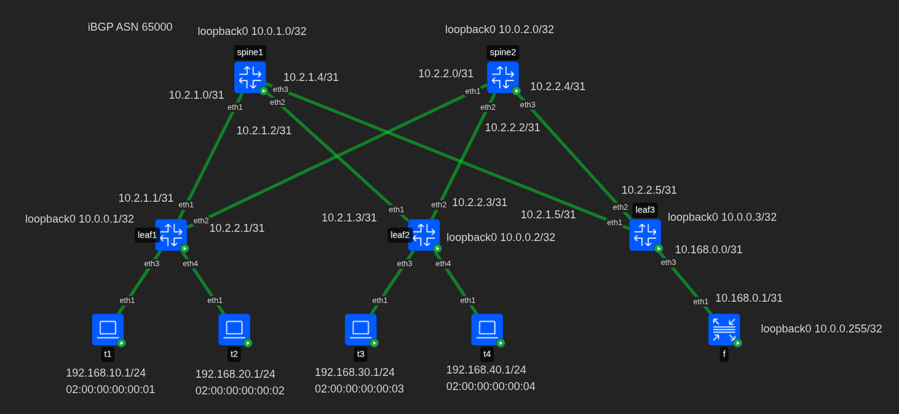
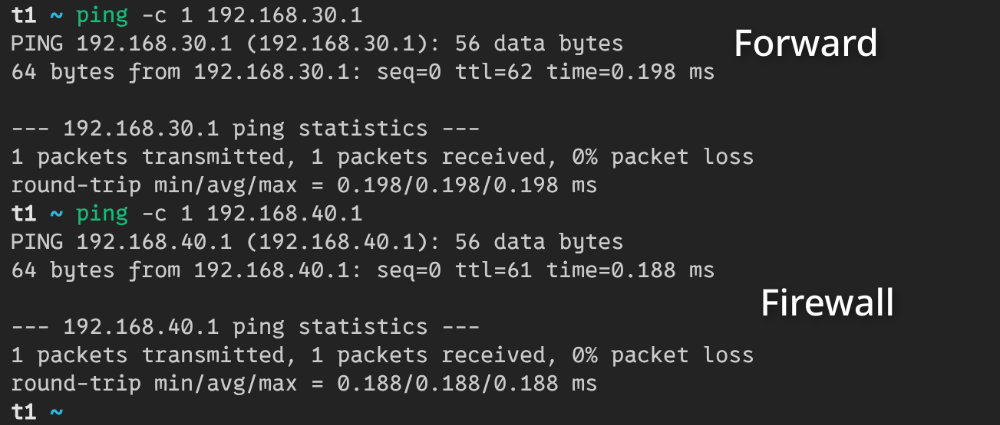
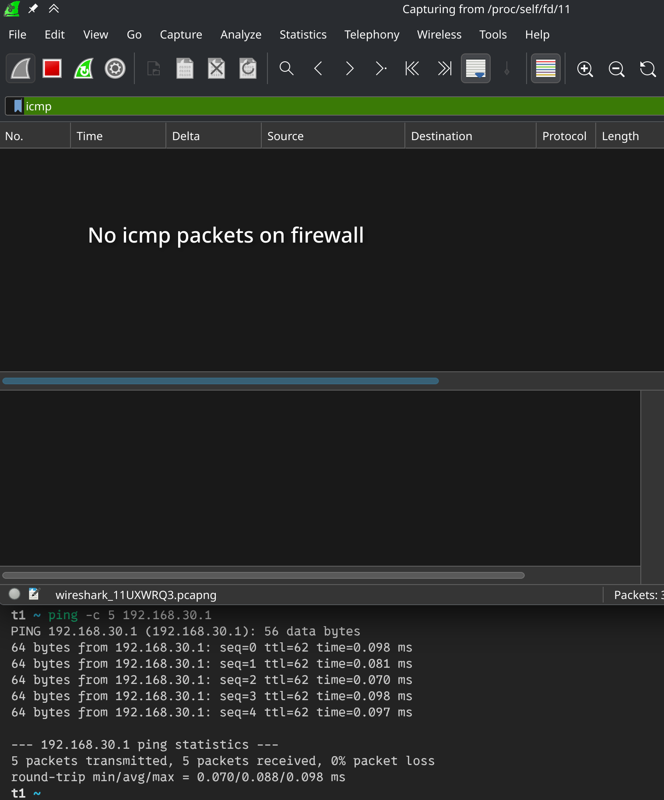
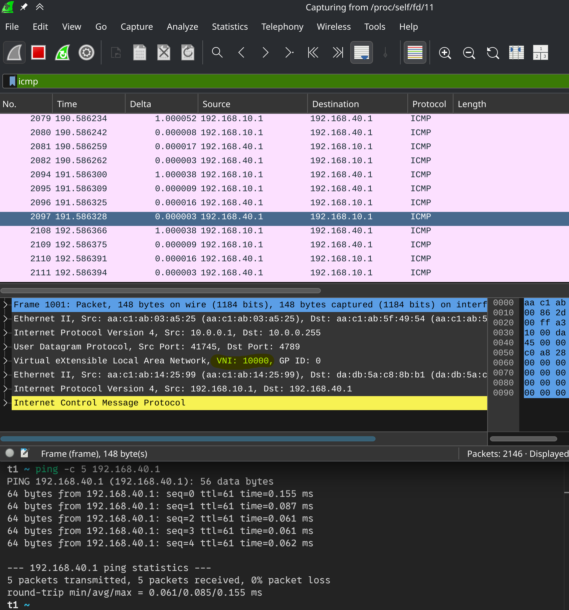
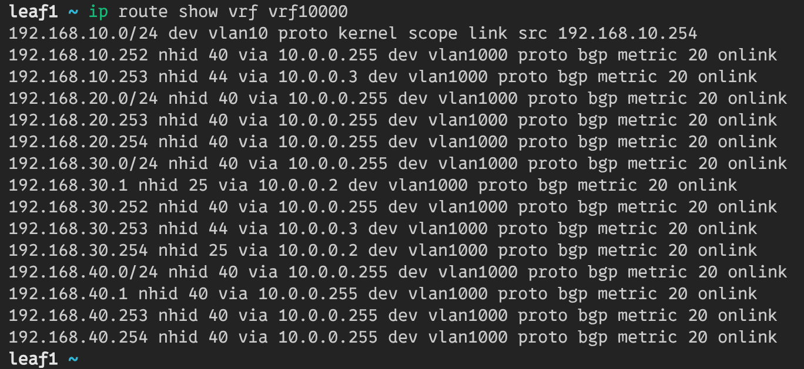
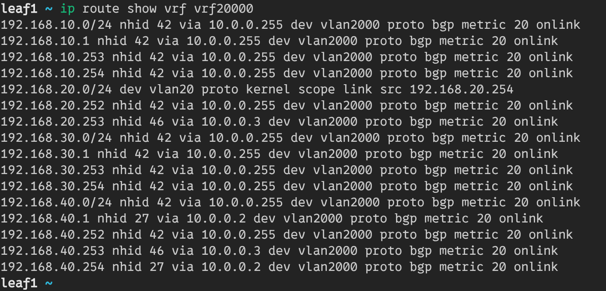

# VxLAN. Routing.

## Схема сети



В лабе используется *iBGP* для underlay сети.  
Все устройства находятся в ASN 65000.

Протокол *iBGP* предполагает полносвязанную топологию,
но в *clos-сетях* ее нет. Поэтому спайн используется как *route-reflector*.

## Конфигурация контейнеров
В качестве контейнеров для лифов и спайнов использутеся тип **frr**.
На них включены следующие демоны **frr**: bfdd, bgpd.  
В качестве контейнеров клиентов используется тип **linux**.  
Firewall сделан на базе **frr**.

## Настройка spine
### Linux

```bash
ip route del default
sysctl -w net.ipv6.conf.all.disable_ipv6=1

# Loopback
ip link add dev loopback0 type dummy
ip address add 10.0.1.0/32 dev loopback0
ip link set dev loopback0 up

# P2p links to leafs
ip address add 10.2.1.0/31 dev eth1
ip address add 10.2.1.2/31 dev eth2
ip address add 10.2.1.4/31 dev eth3
```

Данная настройка удалит маршрут по умолчанию,
создаст loopback0 и установит ip-адреса для p2p линков.

### Frr

```ini
router bgp 65000
 bgp router-id 10.0.1.0
 neighbor LEAFS peer-group
 neighbor LEAFS remote-as internal
 neighbor LEAFS bfd
 neighbor LEAFS password ibgp
 neighbor LEAFS timers 1 3
 neighbor 10.2.1.1 peer-group LEAFS
 neighbor 10.2.1.3 peer-group LEAFS
 neighbor 10.2.1.5 peer-group LEAFS
 !
 address-family ipv4 unicast
  network 10.0.1.0/32
  neighbor LEAFS route-reflector-client
  neighbor LEAFS next-hop-self force
 exit-address-family
 !
 address-family l2vpn evpn
  neighbor LEAFS activate
  neighbor LEAFS route-reflector-client
 exit-address-family
exit
!
end
```

Настраивается AS с номером 65000.  
Для лифов создается peer-group, с базовыми настройками:
аутентификация, bfd, timers.  
В пир группу добавляются лифы.

Для underlay-сети используется `address-family ipv4 unicast`.  
Настраивается `route-reflector-client` и для подмены nexthop,
и корректной работы протокола включается `next-hop-self`.

Для overlay-сети включется `route-reflector-client` в evpn.

## Настройка leaf (leaf1)
### Linux

```bash
ip route del default
sysctl -w net.ipv6.conf.all.disable_ipv6=1

# Loopback
ip link add dev loopback0 type dummy
ip address add 10.0.0.1/32 dev loopback0
ip link set dev loopback0 up

# P2p links to spines
ip address add 10.2.1.1/31 dev eth1
ip address add 10.2.2.1/31 dev eth2

# Bridge
ip link add br0 type bridge vlan_filtering 1 vlan_default_pvid 0
ip link add vxlan0 type vxlan dstport 4789 local 10.0.0.1 nolearning external vnifilter
ip link set vxlan0 master br0
ip link set br0 up
ip link set vxlan0 up
bridge link set dev vxlan0 vlan_tunnel on

# vrf for l3vni 10000
ip link add vrf10000 type vrf table 10000
ip link set vrf10000 up

# vrf for l3vni 20000
ip link add vrf20000 type vrf table 20000
ip link set vrf20000 up

# l3vni 10000 - vlan 1000
bridge vlan add dev br0 vid 1000 self
bridge vlan add dev vxlan0 vid 1000
bridge vni add dev vxlan0 vni 10000
bridge vlan add dev vxlan0 vid 1000 tunnel_info id 10000
ip link add vlan1000 link br0 type vlan id 1000
ip link set vlan1000 master vrf10000
ip link set vlan1000 up

# l2vni 10010 - vlan 10
bridge vlan add dev br0 vid 10 self
bridge vlan add dev vxlan0 vid 10
bridge vni add dev vxlan0 vni 10010
bridge vlan add dev vxlan0 vid 10 tunnel_info id 10010
ip link add vlan10 link br0 type vlan id 10
ip link set vlan10 master vrf10000
ip addr add 192.168.10.254/24 dev vlan10
ip link set vlan10 up

# l3vni 20000 - vlan 2000
bridge vlan add dev br0 vid 2000 self
bridge vlan add dev vxlan0 vid 2000
bridge vni add dev vxlan0 vni 20000
bridge vlan add dev vxlan0 vid 2000 tunnel_info id 20000
ip link add vlan2000 link br0 type vlan id 2000
ip link set vlan2000 master vrf20000
ip link set vlan2000 up

# l2vni 20020 - vlan 20
bridge vlan add dev br0 vid 20 self
bridge vlan add dev vxlan0 vid 20
bridge vni add dev vxlan0 vni 20020
bridge vlan add dev vxlan0 vid 20 tunnel_info id 20020
ip link add vlan20 link br0 type vlan id 20
ip link set vlan20 master vrf20000
ip addr add 192.168.20.254/24 dev vlan20
ip link set vlan20 up

# Links to clients
ip link set dev eth3 master br0
bridge vlan add vid 10 dev eth3 pvid 10 egress untagged

ip link set dev eth4 master br0
bridge vlan add vid 20 dev eth4 pvid 20 egress untagged
```

Данная настройка удалит маршрут по умолчанию,
создаст loopback0 и установит ip-адрес для p2p линка.

Для работы overlay-сети будет создан bridge и
vxlan-интерфейс в режиме single vxlan device.  
Для функционирования l3vni создается vrf10000 и vrf20000.  

Будет настроено соотношение между vni 10000 и vlan 1000,
а также vni 20000 и vlan 2000.
Svi10 для vlan 10 будет помещен в vrf10000. Это служебный vni,
для работы симметричного IRB.  
Svi20 для vlan 20 будет помещен в vrf20000. Это служебный vni,
для работы симметричного IRB.  
Два l3vni обеспечат разграничение клиентов.

Для работы с клиентами настроится маппинг между vni 10010
и vlan 10, а также vni 20020 и vlan 20. На svi для vlan будет назначен ip-адрес 192.168.10.254 и 192.168.20.254 соответсвенно.  
Svi интерфейсы будут находиться в разных vrf.

Для линка в сторону клиента t1 будет назначен vlan 10.  
Для линка в сторону клиента t2 будет назначен vlan 20.

### Frr

```ini
vrf vrf10000
 vni 10000
exit-vrf
!
vrf vrf20000
 vni 20000
exit-vrf
!
router bgp 65000
 bgp router-id 10.0.0.1
 neighbor SPINES peer-group
 neighbor SPINES remote-as internal
 neighbor SPINES bfd
 neighbor SPINES password ibgp
 neighbor SPINES timers 1 3
 neighbor 10.2.1.0 peer-group SPINES
 neighbor 10.2.2.0 peer-group SPINES
 !
 address-family ipv4 unicast
  network 10.0.0.1/32
  maximum-paths ibgp 4
 exit-address-family
 !
 address-family l2vpn evpn
  neighbor SPINES activate
  advertise-all-vni
  advertise-svi-ip
 exit-address-family
exit
!
router bgp 65000 vrf vrf10000
 !
 address-family l2vpn evpn
  advertise ipv4 unicast
 exit-address-family
exit
!
router bgp 65000 vrf vrf20000
 !
 address-family l2vpn evpn
  advertise ipv4 unicast
 exit-address-family
exit
!
end
```

Настраивается AS с номером 65000.  
Для спайна создается peer-group, с базовыми настройками:
аутентификация, bfd, timers.  
В пир группу добавляется спайн.

Для underlay-сети используется `address-family ipv4 unicast`.  
Настраивается `maximum-paths ibgp` для ecmp.

Включается overlay-сеть и распространение vni.
Для overlay-сети настраивается vrf10000, в рамках которого также
будет распространятся l2vpn маршруты.  
Для overlay-сети настраивается vrf20000, в рамках которого также
будет распространятся l2vpn маршруты.

## Настройка leaf (leaf3)
### Linux

```bash
ip route del default
sysctl -w net.ipv6.conf.all.disable_ipv6=1

# Loopbacks
ip link add dev loopback0 type dummy
ip address add 10.0.0.3/32 dev loopback0
ip link set dev loopback0 up

# P2p links to NEIGHBOURS
ip address add 10.2.1.5/31 dev eth1
ip address add 10.2.2.5/31 dev eth2

# Bridge
ip link add br0 type bridge vlan_filtering 1 vlan_default_pvid 0
ip link add vxlan0 type vxlan dstport 4789 local 10.0.0.3 nolearning external vnifilter
ip link set vxlan0 master br0
ip link set br0 up
ip link set vxlan0 up
bridge link set dev vxlan0 vlan_tunnel on

# vrf for l3vni 10000
ip link add vrf10000 type vrf table 10000
ip link set vrf10000 up

# vrf for l3vni 20000
ip link add vrf20000 type vrf table 20000
ip link set vrf20000 up

# l3vni 10000 - vlan 1000
bridge vlan add dev br0 vid 1000 self
bridge vlan add dev vxlan0 vid 1000
bridge vni add dev vxlan0 vni 10000
bridge vlan add dev vxlan0 vid 1000 tunnel_info id 10000
ip link add vlan1000 link br0 type vlan id 1000
ip link set vlan1000 master vrf10000
ip link set vlan1000 up

# l2vni 10010 - vlan 10
bridge vlan add dev br0 vid 10 self
bridge vlan add dev vxlan0 vid 10
bridge vni add dev vxlan0 vni 10010
bridge vlan add dev vxlan0 vid 10 tunnel_info id 10010
ip link add vlan10 link br0 type vlan id 10
ip link set vlan10 master vrf10000
ip addr add 192.168.10.253/24 dev vlan10
ip link set vlan10 up

# l2vni 10030 - vlan 30
bridge vlan add dev br0 vid 30 self
bridge vlan add dev vxlan0 vid 30
bridge vni add dev vxlan0 vni 10030
bridge vlan add dev vxlan0 vid 30 tunnel_info id 10030
ip link add vlan30 link br0 type vlan id 30
ip link set vlan30 master vrf10000
ip addr add 192.168.30.253/24 dev vlan30
ip link set vlan30 up

# l3vni 20000 - vlan 2000
bridge vlan add dev br0 vid 2000 self
bridge vlan add dev vxlan0 vid 2000
bridge vni add dev vxlan0 vni 20000
bridge vlan add dev vxlan0 vid 2000 tunnel_info id 20000
ip link add vlan2000 link br0 type vlan id 2000
ip link set vlan2000 master vrf20000
ip link set vlan2000 up

# l2vni 20020 - vlan 20
bridge vlan add dev br0 vid 20 self
bridge vlan add dev vxlan0 vid 20
bridge vni add dev vxlan0 vni 20020
bridge vlan add dev vxlan0 vid 20 tunnel_info id 20020
ip link add vlan20 link br0 type vlan id 20
ip link set vlan20 master vrf20000
ip addr add 192.168.20.253/24 dev vlan20
ip link set vlan20 up

# l2vni 20040 - vlan 40
bridge vlan add dev br0 vid 40 self
bridge vlan add dev vxlan0 vid 40
bridge vni add dev vxlan0 vni 20040
bridge vlan add dev vxlan0 vid 40 tunnel_info id 20040
ip link add vlan40 link br0 type vlan id 40
ip link set vlan40 master vrf20000
ip addr add 192.168.40.253/24 dev vlan40
ip link set vlan40 up

# Link to firewall
ip link add link eth3 name eth3.1000 type vlan id 1000
ip link set eth3.1000 master vrf10000
ip address add 10.169.0.0/31 dev eth3.1000
ip link set eth3.1000 up
ip link add link eth3 name eth3.2000 type vlan id 2000
ip link set eth3.2000 master vrf20000
ip address add 10.170.0.0/31 dev eth3.2000
ip link set eth3.2000 up
```

На leaf-3 заводятся все vni. Для связи с firewall требуется использовать bgp
в двух vrf, поэтому будут созданы два vlan-интерфейса и помещены в vrf.
Vlan id у них будет соответствовать vlan для vrf.

### Frr

```ini
vrf vrf10000
 vni 10000
exit-vrf
!
vrf vrf20000
 vni 20000
exit-vrf
!
router bgp 65000
 bgp router-id 10.0.0.3
 neighbor SPINES peer-group
 neighbor SPINES remote-as internal
 neighbor SPINES bfd
 neighbor SPINES password ibgp
 neighbor SPINES timers 1 3
 neighbor 10.2.1.4 peer-group SPINES
 neighbor 10.2.2.4 peer-group SPINES
 !
 address-family ipv4 unicast
  network 10.0.0.3/32
  neighbor SPINES route-reflector-client
  neighbor SPINES next-hop-self force
  maximum-paths ibgp 4
 exit-address-family
 !
 address-family l2vpn evpn
  neighbor SPINES activate
  neighbor SPINES route-reflector-client
  advertise-all-vni
  advertise-svi-ip
 exit-address-family
exit
!
router bgp 65000 vrf vrf10000
 bgp router-id 10.0.0.3
 neighbor FIREWALL peer-group
 neighbor FIREWALL remote-as internal
 neighbor FIREWALL bfd
 neighbor FIREWALL password ibgp
 neighbor FIREWALL timers 1 3
 neighbor 10.169.0.1 peer-group FIREWALL
 !
 address-family ipv4 unicast
  network 10.0.0.3/32
  maximum-paths ibgp 4
 exit-address-family
 !
 address-family l2vpn evpn
  advertise ipv4 unicast
 exit-address-family
exit
!
router bgp 65000 vrf vrf20000
 bgp router-id 10.0.0.3
 neighbor FIREWALL peer-group
 neighbor FIREWALL remote-as internal
 neighbor FIREWALL bfd
 neighbor FIREWALL password ibgp
 neighbor FIREWALL timers 1 3
 neighbor 10.170.0.1 peer-group FIREWALL
 !
 address-family ipv4 unicast
  network 10.0.0.3/32
  maximum-paths ibgp 4
 exit-address-family
 !
 address-family l2vpn evpn
  advertise ipv4 unicast
 exit-address-family
exit
!
end
```

Для firewall настраивается отдельный bgp инстанс на каждый vrf. Его настройки
аналогичны bgp для grt.

## Настройка firewall (f)
### Linux

```bash
ip route del default
sysctl -w net.ipv6.conf.all.disable_ipv6=1

# vrf for l3vni 10000
ip link add vrf10000 type vrf table 10000
ip link set vrf10000 up

# vrf for l3vni 20000
ip link add vrf20000 type vrf table 20000
ip link set vrf20000 up

# P2p link to leaf
ip link add link eth1 name eth1.1000 type vlan id 1000
ip link set eth1.1000 master vrf10000
ip link set eth1.1000 up
ip address add 10.169.0.1/31 dev eth1.1000
ip link add link eth1 name eth1.2000 type vlan id 2000
ip link set eth1.2000 master vrf20000
ip address add 10.170.0.1/31 dev eth1.2000
ip link set eth1.2000 up
```

На firewall будут созданы все vrf. Для каждого vrf будет создан vlan-сабинтерфейс,
с соответсвующим vrf vlan id.

### Frr

```ini
route-map RM_FW permit 1
 match ip address AL_FW
exit
!
vrf vrf10000
exit-vrf
!
vrf vrf20000
exit-vrf
!
router bgp 65000 vrf vrf10000
 bgp router-id 10.0.0.255
 neighbor LEAF peer-group
 neighbor LEAF remote-as internal
 neighbor LEAF bfd
 neighbor LEAF password ibgp
 neighbor LEAF timers 1 3
 neighbor 10.169.0.0 peer-group LEAF
 !
 address-family ipv4 unicast
  network 10.0.0.255/32
  maximum-paths ibgp 4
  redistribute connected route-map RM_FW
  import vrf vrf20000
 exit-address-family
exit
!
router bgp 65000 vrf vrf20000
 bgp router-id 10.0.0.255
 neighbor LEAF peer-group
 neighbor LEAF remote-as internal
 neighbor LEAF bfd
 neighbor LEAF password ibgp
 neighbor LEAF timers 1 3
 neighbor 10.170.0.0 peer-group LEAF
 !
 address-family ipv4 unicast
  network 10.0.0.255/32
  maximum-paths ibgp 4
  redistribute connected route-map RM_FW
  import vrf vrf10000
 exit-address-family
exit
!
access-list AL_FW seq 5 permit 192.168.10.0/24
access-list AL_FW seq 10 permit 192.168.20.0/24
access-list AL_FW seq 15 permit 192.168.30.0/24
access-list AL_FW seq 20 permit 192.168.40.0/24
!
end
```

Для передачи маршрутов из одного vrf, в другой используется команда
`import vrf vrfN`.  
Распространение маршрутов по bgp будет происходить с помощью опции
`redistribute connected`, на которую будет дополнительно
добавляться ограничение RM_FW и AL_FW. Это позволит передавать только
интересующие нас подсети.

## Клиент (t1)

```bash
sysctl -w net.ipv6.conf.all.disable_ipv6=1

ip link set address 02:00:00:00:00:01 dev eth1
ip address add 192.168.10.1/24 dev eth1
ip route replace default via 192.168.10.254 dev eth1
```

Для клиента настраивается ip-адрес и маршрут по умолчанию,
через svi-интерфейс на лифе.

## Результат

Клиент может пропинговать устройство из своего vrf, и из другого vrf.



При этом устройство из своего vrf будет доступно напрямую:



А устройство из другого vrf будет доступно через firewall:



Это можно проверить в таблице маршрутизации:



В vrf10000 10 подсеть доступна локально, адрес 30.1 доступен через соседний leaf,
а 20 и 40 подсети, как и адрес 40.1 через firewall.

Vrf20000:



В vrf20000 20 подсеть доступна локально, адрес 40.1 доступен через соседний leaf,
а 10 и 30 подсети, как и адрес 10.1 через firewall.
